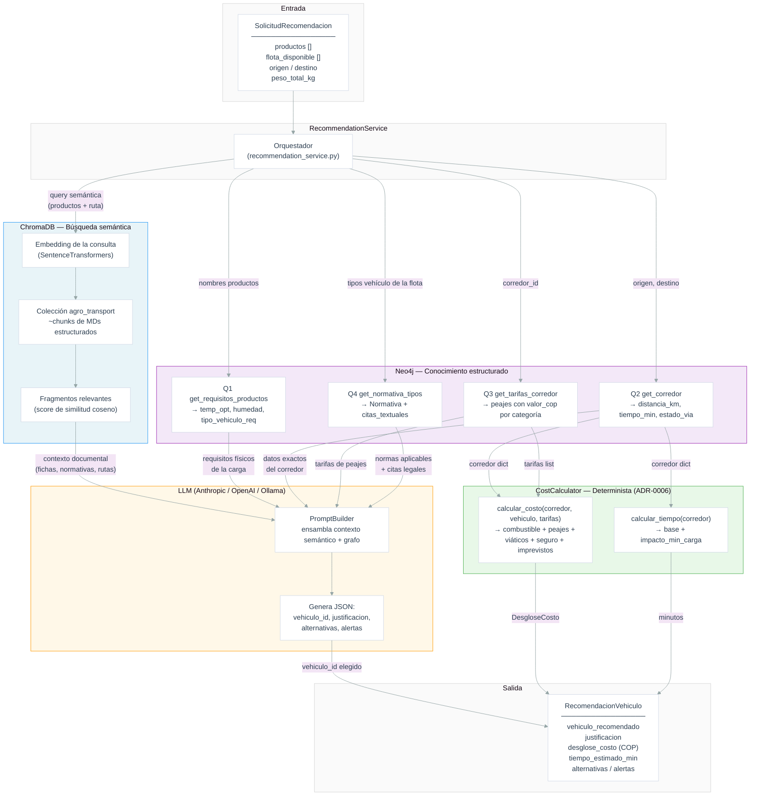

# Arquitectura RAG — Selección Inteligente de Vehículo

## Flujo de una recomendación



## ¿Por qué ChromaDB y Neo4j juntos?

| | ChromaDB | Neo4j |
|---|---|---|
| **Tipo de consulta** | "¿qué fragmentos hablan de transporte refrigerado?" | "¿cuánto cobra exactamente el peaje X para categoría C3?" |
| **Fortaleza** | Encuentra contexto relevante aunque no sepas qué buscar exactamente | Devuelve hechos precisos y relaciones entre entidades |
| **Qué aporta al RAG** | Le da al LLM contexto documental rico para razonar | Le da datos estructurados que el LLM **no debe inventar** (distancias, tarifas, requisitos legales) |
| **Limitación** | No conoce relaciones entre entidades (qué peajes tiene un corredor) | No hace búsqueda por similitud semántica |

El LLM solo decide **qué vehículo elegir y por qué** — los números (costos, tiempos) los
calcula el `CostCalculator` con los datos que ya trajo Neo4j.

## Qué vive en cada base de datos

### ChromaDB — chunks semánticos

Fragmentos de texto (~800 tokens) extraídos de los MDs estructurados, organizados por
categoría (ADR-0007):

| Categoría | Contenido |
|---|---|
| `fichas_tecnicas_productos` | Requisitos de temperatura, humedad y embalaje por cultivo |
| `catalogo_flota_vehicular` | Fichas técnicas de camiones, furgones y tracto-camiones |
| `condiciones_rutas_vias` | Estado de vías, restricciones y tiempos por corredor INVIAS |
| `tarifas_costos_transporte` | Tablas de referencia SICE-TAC y tarifas de fletes |
| `normativa_transporte` | Resoluciones MinTransporte e INVIMA sobre transporte de alimentos |

### Neo4j — grafo de conocimiento

Nodos y relaciones estructuradas para consultas Cypher precisas (ADR-0004, ADR-0005):

```
(:Corredor)──[:PASA_POR]──►(:Ciudad)
(:Corredor)──[:TIENE_PEAJE]──►(:Peaje)──[:TIENE_TARIFA]──►(:Tarifa)
(:Producto)──[:REQUIERE]──►(:ConfiguracionVehicular)
(:Normativa)──[:REGULA]──►(:TipoVehiculo)
(:Normativa)──[:CONTIENE]──►(:Articulo)
```

Las 4 queries Cypher fijas del servicio evitan que el LLM genere Cypher dinámico
(ADR-0005), eliminando riesgo de inyección y resultados no deterministas.

