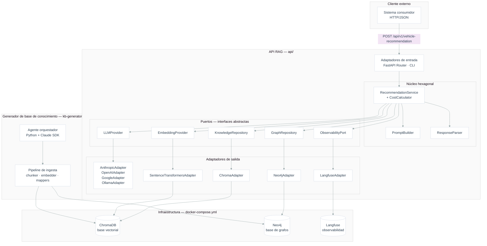
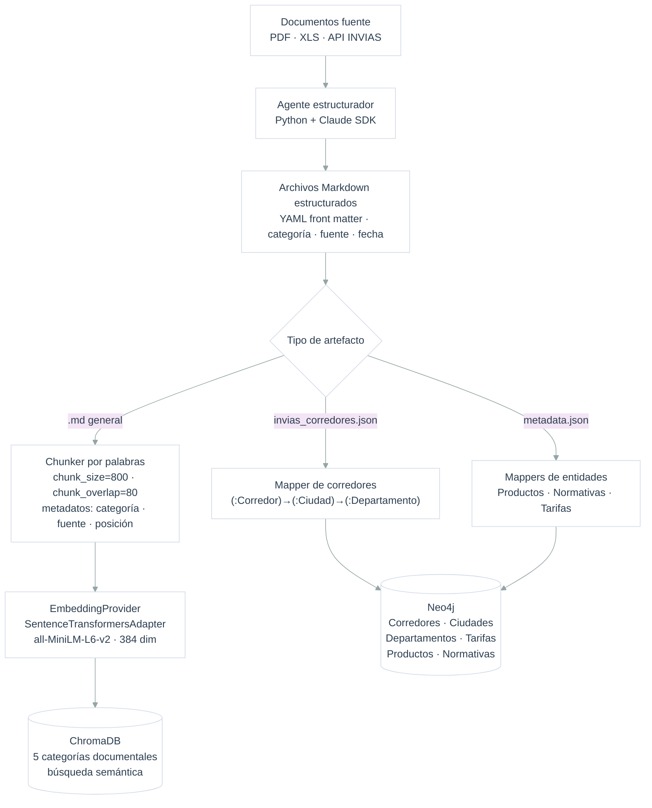
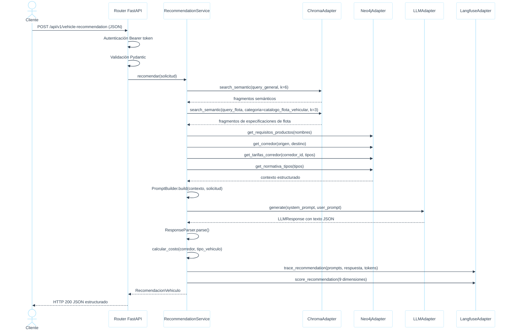

# Diseño y Análisis de Resultados. Entrega Final

**Informe técnico. Caso de aplicación**

**API RAG para selección de vehículo**

*Servicio agnóstico al consumidor, construido en Python*

**Autores:**
Edward Alejandro Rayo Cortés, Elizabeth Toro Chalarca, Santiago Andrés Cardona Julio

Medellín, 2025

---

## Historia de versiones

| Versión | Fecha    | Descripción del cambio                                                                                                                                             |
|---------|----------|--------------------------------------------------------------------------------------------------------------------------------------------------------------------|
| 1       | 20250410 | Inicio. Definición de la funcionalidad RAG y de la base de conocimiento. Propuesta de arquitectura hexagonal y documentación del caso de aplicación.               |
| 2       | 20260422 | Entrega final. Descripción de la arquitectura implementada, pipeline de ingesta, análisis comparativo LLM frente a SLM y evaluación experimental con Langfuse.    |

---

## Contenido

0. Introducción
1. Arquitectura implementada
   - 1.1 Vista general del sistema
   - 1.2 Pipeline de ingesta de la base de conocimiento
   - 1.3 Flujo de inferencia RAG
   - 1.4 Adaptadores de LLM: modelos comerciales frente a modelos locales
   - 1.5 Ingeniería de prompts
   - 1.6 Observabilidad
2. Evolución respecto a la propuesta inicial
3. Evaluación experimental
   - 3.1 Diseño de la evaluación
   - 3.2 Solicitudes de prueba
   - 3.3 Métricas de evaluación
   - 3.4 Resultados comparativos por proveedor
   - 3.5 Análisis por proveedor
   - 3.6 Análisis por dimensión
4. Hallazgos y discusión
   - 4.1 Consideraciones de las librerías y frameworks
   - 4.2 Análisis de las herramientas
5. Conclusiones
6. Posibles integraciones Evergreen
   - 6.1 Integración con PRO y PLA: demanda de transporte a partir de ventanas de cosecha
   - 6.2 Integración con FIN: enriquecimiento de tarifas y visibilidad de costos logísticos
   - 6.3 Integración con ANA: analítica del pipeline de recomendación y mejora de prompts
7. Referencias
8. Apéndice A. Glosario de siglas y abreviaturas

---

## 0. Introducción

La entrega inicial [1] estableció el diseño de una API RAG para la selección inteligente de vehículos de transporte en logística agrícola colombiana. El servicio se concibió con arquitectura hexagonal, una base de conocimiento documental especializada y capacidad de integración con múltiples proveedores de modelos de lenguaje. Esta segunda entrega describe la implementación efectiva del sistema, documenta las decisiones que difirieron de la propuesta original y presenta los resultados de la evaluación experimental realizada sobre 47 trazas registradas en la plataforma de observabilidad Langfuse [2].

El servicio construido respetó el enfoque agnóstico al consumidor definido en [1]: recibió un pedido con datos del producto y la flota disponible, recuperó contexto de una base vectorial (ChromaDB) [3] y una base de grafos (Neo4j) [4], razonó mediante un modelo de lenguaje y retornó una recomendación estructurada. La arquitectura hexagonal, descrita como propuesta en la entrega anterior, se implementó en su totalidad.

Los tres componentes del repositorio, la API REST, el generador de la base de conocimiento y la infraestructura de datos, operaron de forma independiente. Esta separación preservó la cohesión del dominio y permitió actualizar la base documental sin detener el servicio de inferencia, una característica determinante para entornos logísticos donde las normativas, los corredores viales y los catálogos de flota se actualizan periódicamente.

El documento se organizó de la siguiente forma. La Sección 1 describe la arquitectura implementada, con énfasis en el pipeline de ingesta y en las variaciones de comportamiento según el tipo de modelo empleado. La Sección 2 detalla los cambios respecto a la propuesta inicial. La Sección 3 presenta el diseño experimental y los resultados obtenidos. La Sección 4 discute los hallazgos, incluyendo las consideraciones sobre las librerías y herramientas utilizadas. La Sección 5 recoge las conclusiones. La Sección 6 propone líneas de integración del servicio con otros módulos de la plataforma Evergreen.

---

## 1. Arquitectura implementada

### 1.1 Vista general del sistema

El sistema se compone de tres subsistemas independientes. En primer lugar, la API REST (directorio `api/`), que expone el endpoint de recomendación y contiene el núcleo hexagonal. En segundo lugar, el generador de la base de conocimiento (`kb-generator/`), que descarga, estructura e ingesta documentos en ChromaDB y Neo4j. En tercer lugar, la infraestructura de datos (`docker-compose.yml`), que orquesta ChromaDB y Neo4j como servicios accesibles por ambos componentes.

La Figura 1 presenta la vista general del sistema con las relaciones entre sus capas principales.

*Figura 1. Vista general de la arquitectura implementada.*

El núcleo hexagonal concentró la lógica de aplicación y de dominio sin dependencias directas hacia frameworks, bases de datos ni proveedores de LLM. Los cinco puertos definidos, `KnowledgeRepository`, `GraphRepository`, `LLMProvider`, `EmbeddingProvider` y `ObservabilityPort`, operaron como interfaces abstractas que los adaptadores de salida implementaron. Esta separación permitió intercambiar el proveedor de LLM mediante variable de entorno, sin alterar el caso de uso `RecommendationService`.

### 1.2 Pipeline de ingesta de la base de conocimiento

La base de conocimiento se construyó a partir de documentos estructurados en formato Markdown. Cada documento fuente (PDF, XLS, datos de API) se transformó en un archivo `.md` con YAML front matter que registró la categoría, la fuente y la fecha de actualización. Los archivos en formato bruto residieron en `base_conocimiento/fuentes/` y no se ingestaron directamente; la ingestión operó sobre los Markdown en `base_conocimiento/estructurados/`.

La Figura 2 presenta el flujo del pipeline de ingesta de extremo a extremo.

*Figura 2. Pipeline de ingesta de la base de conocimiento.*

El proceso de segmentación aplicó una ventana deslizante sobre palabras con `chunk_size=800` y `chunk_overlap=80`. Este esquema difirió de la propuesta inicial [1], que anticipaba el uso del `RecursiveCharacterTextSplitter` de LangChain [5]. Se optó por una implementación propia para reducir dependencias externas y mantener control directo sobre la granularidad de la segmentación por dominio. El tamaño de 800 palabras se estableció al verificar que los documentos más densos del corpus, las resoluciones del Ministerio de Transporte, contenían párrafos normativos de entre 600 y 750 palabras; un chunk inferior a ese umbral habría partido las resoluciones en fragmentos sin contexto suficiente para el LLM.

Cada chunk se almacenó en ChromaDB con metadatos de categoría, fuente y posición en el documento original. Las cinco categorías documentales, `fichas_tecnicas_productos`, `catalogo_flota_vehicular`, `condiciones_rutas_vias`, `tarifas_costos_transporte` y `normativa_transporte`, se preservaron como metadatos para habilitar el filtrado por categoría durante la recuperación semántica. Los scores de similitud coseno registrados durante la evaluación variaron entre 0.00 y 0.43 según el tipo de solicitud, lo que evidenció sensibilidad del índice vectorial al vocabulario de la consulta y motivó la estrategia de doble recuperación descrita en la Sección 1.3.

El modelo de embeddings `all-MiniLM-L6-v2` [6], con vectores de 384 dimensiones, se ejecutó de forma local mediante SentenceTransformers. Esta elección respondió a dos criterios: ausencia de costo por token y posibilidad de operación sin acceso a internet, condición relevante para despliegues en entornos con restricciones de conectividad o requisitos de confidencialidad.

La ingestión en Neo4j operó mediante mappers especializados por tipo de entidad. Los corredores viales, con sus ciudades de origen y destino, se modelaron como nodos `(:Corredor)` conectados a `(:Ciudad)` y `(:Departamento)`. Los requisitos de transporte por producto [7], las normativas vigentes [8] y las tarifas por tipo de vehículo y corredor se ingestaron como nodos relacionados. Esta estructura habilitó las cuatro consultas Cypher parametrizadas que el `GraphRepository` ejecutó durante cada inferencia: requisitos del producto, corredor entre ciudades, tarifas del corredor y normativa por tipo de vehículo.

### 1.3 Flujo de inferencia RAG

El flujo de inferencia siguió cuatro fases desde la recepción de la solicitud hasta la entrega de la respuesta al consumidor. La Figura 3 presenta la secuencia de llamadas entre componentes.

*Figura 3. Diagrama de secuencia del flujo de inferencia RAG.*

La recuperación semántica realizó dos consultas a ChromaDB: una genérica sobre el pedido completo y una específica filtrada por la categoría `catalogo_flota_vehicular`. Los fragmentos no duplicados de ambas consultas se concatenaron antes de construir el prompt. Este doble paso de recuperación no estaba contemplado en la propuesta inicial; se incorporó al observar que la consulta genérica tendía a recuperar fragmentos de normativa y condiciones de ruta, dejando sin representación las especificaciones técnicas de los vehículos disponibles en la flota.

### 1.4 Adaptadores de LLM: modelos comerciales frente a modelos locales

El sistema implementó cuatro adaptadores del puerto `LLMProvider`: `AnthropicAdapter` (Claude Sonnet 4.6) [9], `OpenAIAdapter` (GPT-4o-mini) [10], `GoogleAdapter` (Gemini 2.5 Flash) y `OllamaAdapter` (modelos locales vía Ollama) [11]. La Tabla 1 contrasta las características operativas de cada grupo.

*Tabla 1. Comparación entre adaptadores de modelos comerciales y modelos locales.*

| Característica | LLMs comerciales (Claude, GPT-4o, Gemini) | SLMs locales (Ollama) |
|---|---|---|
| Modo de salida estructurada | JSON mode nativo o instrucción concisa en prompt | Modo estricto: esquema JSON explícito más ejemplo concreto en prompt |
| Consistencia de salida | Alta. El JSON mode rechaza respuestas con formato incorrecto. | Variable. Requiere instrucciones de formato más detalladas para alcanzar conformidad. |
| Razonamiento con contexto acotado | Mayor adherencia a restricciones del dominio | Dependiente del modelo descargado y del tamaño de contexto disponible |
| Latencia de respuesta | 2-15 segundos (red más inferencia remota) | 60-250 s (inferencia local según hardware disponible; promedio observado: 188 s) |
| Privacidad de los datos | Los prompts viajan a servidores del proveedor externo | Los datos permanecen en el entorno local |
| Costo operativo | Por token consumido en cada inferencia | Hardware local, sin costo por llamada |
| Ventana de contexto | 128 000 – 1 000 000 tokens según modelo (GPT-4o-mini: 128k; Gemini 2.5 Flash: 1M; Claude Sonnet 4.6: 200k) | 32 768 tokens (qwen2.5:3b) |
| Propiedad en código | `strict_output = False` | `strict_output = True` |

La propiedad `strict_output` del puerto `LLMProvider` determinó cuál de las dos plantillas de prompt aplicó el `PromptBuilder`. Para los modelos comerciales, el prompt del sistema incluyó el esquema JSON en formato de plantilla con instrucciones compactas. Para los modelos locales, el `PromptBuilder` añadió un bloque `<constraints>` con restricciones explícitas y un ejemplo de respuesta completo, lo que redujo la tasa de respuestas con formato incorrecto durante las pruebas con Ollama.

La diferencia más notable en el comportamiento radicó en la adherencia a restricciones del dominio. Los LLMs comerciales respetaron de forma consistente la prohibición de mencionar costos o tiempos de tránsito, incluida en el prompt del sistema. Los modelos locales, con menor capacidad de seguimiento de instrucciones implícitas, requirieron la repetición de esta restricción en el bloque de constraints del modo estricto.

En la práctica, Google Gemini no utilizó JSON mode nativo durante la evaluación: las respuestas llegaron envueltas en bloques de código Markdown, lo que obligó al `ResponseParser` a activar su estrategia de extracción por expresión regular. OpenAI entregó JSON limpio sin envoltorios. Esta distinción operativa no afectó la lógica del núcleo hexagonal, dado que el `ResponseParser` absorbió la variación, pero sí es relevante para el diagnóstico de latencia de parseo y para la generalización de la columna "Modo de salida estructurada" de la Tabla 1. Adicionalmente, el análisis posterior a la evaluación identificó que el `GoogleAdapter` concatenaba ambos prompts en un único string en lugar de emplear el parámetro `system_instruction` del SDK; la corrección se aplicó sobre el adaptador y se documenta en el Hallazgo 6.

### 1.5 Ingeniería de prompts

El `PromptBuilder` implementó dos plantillas versionadas bajo el identificador `v2`. La plantilla base construyó el prompt en formato XML semi-estructurado, apta para LLMs comerciales. La plantilla estricta extendió la base con un bloque `<constraints>` explícito y un ejemplo de respuesta JSON concreto, activada al detectar `strict_output=True` en el adaptador activo.

El prompt del sistema estableció cuatro elementos. Primero, el rol: ingeniero de logística agrícola colombiana con la responsabilidad de asignar el vehículo óptimo con base en datos técnicos, normativos y de carga. Segundo, las reglas de contexto: prioridad de refrigeración para productos perecederos, respeto de la capacidad máxima del vehículo, selección del vehículo más adecuado con alerta de nivel alto cuando ninguno cumplió todos los requisitos, y prohibición de mencionar costos o tiempos de tránsito. Tercero, el flujo de trabajo en cuatro pasos: análisis del pedido, comparación con el contexto recuperado, selección del vehículo y redacción de la justificación. Cuarto, el formato de salida: JSON plano sin bloques de código markdown ni texto introductorio.

El prompt del usuario estructuró la información en cuatro secciones:

- `<document_context>`: fragmentos recuperados de ChromaDB con categoría, fuente y score de similitud.
- `<graph_context>`: datos del corredor vial, requisitos del producto desde Neo4j, normativa aplicable y tarifas disponibles.
- `<transport_request>`: identificador del pedido, fecha de entrega, prioridad, ruta origen-destino y detalle de los productos con peso total.
- `<available_fleet>`: lista de vehículos con identificador, tipo, capacidad en kilogramos y bandera de refrigeración.

La instrucción de cierre del prompt del usuario precisó los campos obligatorios de la respuesta y solicitó explícitamente una entrada en `alternativas` por cada vehículo de la flota no seleccionado, con el motivo de rechazo correspondiente. Esta instrucción fue determinante para mejorar la completitud de las alternativas respecto a versiones anteriores del prompt.

### 1.6 Observabilidad

El puerto `ObservabilityPort` se implementó mediante `LangfuseAdapter`, que registró cada inferencia como una traza en Langfuse self-hosted versión 2.60 [2]. Cada traza capturó el prompt completo (sistema y usuario), la respuesta del LLM, el vehículo seleccionado, el modelo y el proveedor activos, los tokens consumidos y nueve scores de calidad calculados sobre la respuesta procesada.

Los nueve scores se definieron como la tupla canónica `SCORE_KEYS` en el módulo `interfaces.py`, la única fuente de verdad para los nombres de dimensión en todo el sistema. Ambos productores de scores, el `RecommendationService` y el agente de evaluación `llm_comparison_agent.py`, aplicaron una aserción en tiempo de ejecución para garantizar que el conjunto de claves enviado a Langfuse coincidiera con `SCORE_KEYS`. Este mecanismo detectó la discrepancia histórica entre el nombre `completitud` (trazas anteriores al cambio) y `completitud_alternativas` (nombre canónico vigente), y la resolvió sin pérdida de datos mediante un mapa de aliases `_SCORE_ALIASES` aplicado durante la exportación.

---

## 2. Evolución respecto a la propuesta inicial

La implementación conservó los elementos estructurales definidos en [1]: la arquitectura hexagonal, los puertos `KnowledgeRepository`, `LLMProvider` y `EmbeddingProvider`, el adaptador `ChromaAdapter` y el flujo de cuatro fases de la funcionalidad RAG. No obstante, se introdujeron cambios relevantes en siete aspectos que se detallan en la Tabla 2.

*Tabla 2. Cambios entre la propuesta inicial y la implementación final.*

| Aspecto | Propuesta inicial [1] | Implementación final |
|---|---|---|
| Puerto de grafos | `KnowledgeRepository` cubría grafo y base vectorial | `GraphRepository` como puerto independiente de Neo4j con cuatro operaciones Cypher |
| Puerto de observabilidad | No contemplado | `ObservabilityPort` con `LangfuseAdapter` self-hosted |
| Calculador de costos de transporte | `CostCalculator` como módulo separado (ADR-0006) | Implementado como función determinista en `cost_calculator.py`. Consume del grafo la distancia del corredor y los peajes (`valor_cop`); aplica constantes SICE-TAC para combustible, viáticos y seguro de carga. El LLM tiene prohibición explícita de generar valores de costo para evitar alucinaciones. |
| Segmentador de texto | `RecursiveCharacterTextSplitter` de LangChain | Implementación propia por palabras (`chunk_size=800`, `overlap=80`) |
| Recuperación semántica | Una consulta genérica | Dos consultas: genérica más consulta filtrada por categoría de flota |
| Plantillas de prompt | Una plantilla única | Dos plantillas: base y estricta, según `strict_output` del adaptador |
| Gestión de scores | No especificada | Tupla canónica `SCORE_KEYS` en `interfaces.py` con validación en tiempo de ejecución |

La separación de `GraphRepository` como puerto independiente respondió a la necesidad de consultas Cypher parametrizadas con contratos diferentes al `search_semantic` genérico de `KnowledgeRepository`. Las cuatro operaciones del grafo representaron un contrato diferenciado que, de haberse agrupado bajo `KnowledgeRepository`, habría mezclado dos naturalezas de acceso al conocimiento con semánticas distintas.

La adición de `ObservabilityPort` no estaba en la propuesta inicial. La necesidad surgió durante el desarrollo al requerirse trazabilidad auditable de cada inferencia para el proceso de evaluación experimental. Langfuse, desplegado como servicio self-hosted, permitió registrar prompts, respuestas y scores sin transmitir datos a servidores externos, coherente con la política de privacidad establecida para el adaptador de Ollama.

El `CostCalculator` contemplado en ADR-0006 se implementó como módulo determinista en `cost_calculator.py`. La restricción en el prompt del sistema prohibió al LLM generar valores de costo; el cálculo efectivo recayó sobre el módulo determinista, que consumió la distancia del corredor y los peajes desde Neo4j para estimar combustible, viáticos, seguro y peajes.

---

## 3. Evaluación experimental

### 3.1 Diseño de la evaluación

La evaluación midió la calidad de las recomendaciones producidas por el sistema con tres proveedores de modelo de lenguaje: Ollama con qwen2.5:3b-instruct-q4_K_M como representante de modelos locales, Google con Gemini 2.5 Flash y OpenAI con GPT-4o-mini como representantes de modelos comerciales en la nube. Se diseñaron seis solicitudes de prueba, identificadas de EVAL-001 a EVAL-006, cada una con una respuesta esperada definida: el vehículo óptimo, los vehículos aceptables y los criterios de rechazo para los demás vehículos de la flota disponible. Las solicitudes cubrieron escenarios con niveles de dificultad diferenciados: requisito de refrigeración para productos perecederos, restricción estricta de capacidad, ambigüedad entre dos vehículos con características similares y casos con restricciones de ruta.

La comparación formal ejecutó cada solicitud una vez por proveedor (18 respuestas en total: 6 solicitudes por 3 proveedores). Las trazas generadas de forma iterativa con el comando `make eval-run` registraron 41 trazas con scores completos en Langfuse, distribuidas entre los tres proveedores. Se excluyeron del análisis cuantitativo las 3 trazas tempranas sin scores registrados. El agente `llm_comparison_agent.py` registró las trazas y el `RecommendationService` calculó los nueve scores de forma determinista sobre cada respuesta parseada.

### 3.2 Solicitudes de prueba

La Tabla 3 presenta la distribución de trazas por solicitud, los vehículos seleccionados por el sistema y el promedio de la evaluación.

*Tabla 3. Distribución de trazas por solicitud de evaluación (n = 41 trazas con scores).*

| Solicitud | Trazas evaluadas | Vehículos seleccionados | Promedio |
|-----------|:----------------:|-------------------------|:--------:|
| EVAL-001  | 13               | VEH-01 (100%)           | 8.84     |
| EVAL-002  | 8                | VEH-03 (62.5%), VEH-04 (37.5%) | 8.02 |
| EVAL-003  | 8                | VEH-06 (62.5%), VEH-05 (37.5%) | 7.42 |
| EVAL-004  | 6                | VEH-07 (83.3%), VEH-08 (16.7%) | 8.19 |
| EVAL-005  | 3                | VEH-10 (66.7%), VEH-09 (33.3%) | 7.91 |
| EVAL-006  | 3                | VEH-12 (100%)           | 8.00     |
| **Total** | **41**           |                         | **8.18** |

Como se observa en la Tabla 3, EVAL-001 registró el desempeño más alto (8.84) con selección del vehículo óptimo en el 100% de las ejecuciones. EVAL-003 registró el desempeño más bajo (7.42) con una distribución de selección desfavorable: el sistema eligió con mayor frecuencia el vehículo subóptimo (VEH-06, 62.5%) en lugar del óptimo (VEH-05, 37.5%), lo que señaló este caso como el de mayor dificultad para el pipeline de recuperación.

*Nota: los datos de la Tabla 3 corresponden al ciclo de evaluación inicial (sin `system_instruction` en el `GoogleAdapter`). El comportamiento de Google en EVAL-006 con `system_instruction` activo se documenta en la Tabla 8.*

### 3.3 Métricas de evaluación

La evaluación operó con nueve dimensiones de scoring calculadas de forma determinista por el `RecommendationService` a partir de la respuesta parseada y los datos de la solicitud. La Tabla 4 describe cada dimensión.

*Tabla 4. Definición de las nueve dimensiones de evaluación.*

| Dimensión | Descripción |
|---|---|
| `adherencia_schema` | La respuesta contiene una justificación no vacía y no genérica |
| `idioma` | La justificación está redactada en español |
| `calidad_justificacion` | Extensión mínima (40 palabras) y presencia de vocabulario técnico del dominio |
| `precision_tecnica` | Densidad de términos técnicos especializados en la justificación |
| `seleccion_vehiculo` | Comparación entre el vehículo seleccionado y los criterios de la solicitud (refrigeración, capacidad) |
| `completitud_alternativas` | Presencia de alternativas y coherencia de los motivos de rechazo con el criterio determinante |
| `veracidad` | Mención del producto transportado, el peso total y la ciudad de destino en la justificación |
| `relevancia` | La justificación aborda explícitamente la restricción determinante del caso |
| `promedio` | Media aritmética de las ocho dimensiones anteriores. No se contabiliza como dimensión independiente en los cálculos agregados. |

### 3.4 Resultados comparativos por proveedor

La Tabla 5 presenta los resultados de la comparación formal entre los tres proveedores sobre las seis solicitudes de prueba (n = 6 por proveedor).

*Tabla 5. Comparación de proveedores por dimensión de evaluación (media ± desv. estándar, n = 6 por proveedor).*

| Dimensión | Ollama (qwen2.5:3b) | Google (gemini-2.5-flash) | OpenAI (gpt-4o-mini) |
|---|:---:|:---:|:---:|
| Adherencia al esquema | 10.0 ± 0.0 | 10.0 ± 0.0 | 10.0 ± 0.0 |
| Selección del vehículo | 6.67 ± 3.01 | 9.67 ± 0.82 | 7.67 ± 2.94 |
| Calidad de justificación | 10.0 ± 0.0 | 10.0 ± 0.0 | 10.0 ± 0.0 |
| Completitud de alternativas | 5.83 ± 2.04 | 8.67 ± 2.16 | 7.0 ± 2.45 |
| Veracidad | 4.33 ± 1.37 | 7.5 ± 1.22 | 6.33 ± 1.63 |
| Relevancia | 3.17 ± 2.48 | 7.33 ± 2.25 | 6.0 ± 2.19 |
| Precisión técnica | 7.5 ± 1.22 | 8.0 ± 1.55 | 7.5 ± 1.22 |
| Idioma | 10.0 ± 0.0 | 10.0 ± 0.0 | 10.0 ± 0.0 |
| Latencia media | 188.36 s | 14.61 s | 5.1 s |
| **Promedio global** | **7.19/10** | **8.90/10** | **8.06/10** |

Como se aprecia en la Tabla 5, Google obtuvo el mayor promedio global (8.90/10), seguido de OpenAI (8.06/10) y Ollama (7.19/10). Los valores provienen de la comparación formal sobre las seis solicitudes de prueba (EVAL-001 a EVAL-006). Las dimensiones de adherencia al esquema, calidad de justificación e idioma alcanzaron el valor máximo en los tres proveedores, lo que confirmó que el diseño del prompt garantizó conformidad estructural con independencia del modelo empleado. Las mayores diferencias entre proveedores se concentraron en relevancia (3.17 vs. 7.33 vs. 6.0) y veracidad (4.33 vs. 7.5 vs. 6.33), que miden la coherencia entre la justificación producida y los datos concretos de la solicitud.

La Figura 4 presenta los promedios de las cinco dimensiones con mayor variabilidad entre proveedores.

*Figura 4. Comparación por dimensión en las cinco dimensiones diferenciadas (Ollama / Google / OpenAI).*

| Dimensión | Ollama | Google | OpenAI |
|---|:---:|:---:|:---:|
| Selección del vehículo | 6.67 | 9.67 | 7.67 |
| Completitud de alternativas | 5.83 | 8.67 | 7.00 |
| Veracidad | 4.33 | 7.50 | 6.33 |
| Relevancia | 3.17 | 7.33 | 6.00 |
| Precisión técnica | 7.50 | 8.00 | 7.50 |

### 3.5 Análisis por proveedor

**Ollama (qwen2.5:3b-instruct-q4_K_M).** El modelo local seleccionó el vehículo técnicamente correcto en cuatro de seis solicitudes. En EVAL-002 eligió VEH-04, refrigerado con capacidad de 3 000 kg, para transportar 4 500 kg de papa pastusa y yuca. Esta elección violó la restricción de capacidad y asignó refrigeración innecesaria para productos que no la requieren. En EVAL-003 seleccionó VEH-06 mientras la justificación describía VEH-05 como el vehículo óptimo: una contradicción interna que evidenció dificultades del modelo para distinguir el vehículo elegido del alternativo dentro de una misma respuesta. La estructura de nivel superior del JSON fue perfecta en todas las solicitudes, pero los subcampos de `alternativas` variaron entre respuestas con nombres distintos (`justificacion_descartado`, `descartado_por`, `explicacion`), lo que dificulta el parseo automatizado sin lógica de fallback. La latencia promedio de 188.36 s hace inviable el uso interactivo en tiempo real.

**Google (gemini-2.5-flash).** El modelo de Google seleccionó el vehículo técnicamente correcto en las seis solicitudes y no presentó contradicciones internas. Las justificaciones citaron documentos del contexto RAG por nombre y número, y referenciaron normativa colombiana específica (Resolución 002505 de 2004, Resolución 2674 de 2013). En EVAL-004, donde dos vehículos cumplieron todas las restricciones, Google eligió VEH-08 (2 500 kg) sobre VEH-07 (5 000 kg) por ajuste de capacidad más eficiente, lo que demostró razonamiento de optimización más allá de la verificación binaria de restricciones. La latencia promedio de 14.61 s es compatible con flujos interactivos. Las respuestas llegaron envueltas en bloques de código Markdown, lo que requirió una etapa de extracción adicional en el `ResponseParser`.

**OpenAI (gpt-4o-mini).** El modelo de OpenAI obtuvo un desempeño intermedio (8.06/10) con selecciones correctas en cuatro de seis solicitudes. En EVAL-003 eligió VEH-06, sin refrigeración, para el transporte de rosas frescas y claveles, sin aplicar la regla de prioridad de frío del prompt del sistema. En EVAL-005 eligió VEH-10, sin refrigeración, para leche pasteurizada y queso fresco, argumentando que los lácteos no requieren cadena de frío activa. En EVAL-004, al igual que Ollama y a diferencia de Google, eligió VEH-07 por mayor margen de capacidad. La latencia promedio de 5.1 s fue la menor de los tres proveedores. Las respuestas entregaron JSON limpio sin envoltorios de Markdown.

### 3.6 Análisis por dimensión

**Dimensiones con puntaje perfecto en los tres proveedores: adherencia al esquema, calidad de justificación, idioma.** Los tres modelos generaron JSON con los cuatro campos canónicos, produjeron justificaciones con vocabulario técnico del dominio logístico y respondieron en español en la totalidad de las solicitudes. El diseño del prompt, en modo base para LLMs comerciales y en modo estricto para Ollama, garantizó conformidad estructural y lingüística con independencia del proveedor.

**Selección del vehículo.** Esta dimensión presentó la mayor diferencia entre el modelo de mejor y peor desempeño. Google alcanzó 9.67 con una desviación de ±0.82 y seleccionó el vehículo correcto en las seis solicitudes. OpenAI registró 7.67 (±2.94) con dos fallas en casos de prioridad de frío para productos perecederos. Ollama obtuvo el valor más bajo (6.67, ±3.01) con dos fallas graves: una violación simultánea de capacidad y refrigeración en EVAL-002, y una contradicción interna en la justificación en EVAL-003. La elevada variabilidad de Ollama y OpenAI indicó que el razonamiento con restricciones simultáneas favorece modelos de mayor capacidad de inferencia.

**Completitud de alternativas.** Google obtuvo 8.67 frente a 7.0 de OpenAI y 5.83 de Ollama. Las respuestas de Google incluyeron motivos de rechazo coherentes con el criterio determinante del caso en todas las solicitudes. La variabilidad de Ollama (±2.04) reflejó respuestas donde los motivos de rechazo no correspondieron a las restricciones técnicas aplicables.

**Veracidad y relevancia.** Estas dimensiones registraron las mayores brechas entre proveedores. En veracidad, Google (7.5) superó en 3.17 puntos a Ollama (4.33) y en 1.17 puntos a OpenAI (6.33). En relevancia, la diferencia entre Google (7.33) y Ollama (3.17) ascendió a 4.16 puntos. Ollama tendió a producir justificaciones técnicas genéricas sin mencionar el peso específico de la carga, las ciudades de la ruta ni el criterio que determinó la selección. Google integró estos datos de forma sistemática. OpenAI ocupó una posición intermedia en ambas dimensiones.

**Precisión técnica.** Los tres proveedores obtuvieron puntajes similares: 7.5 para Ollama y OpenAI, 8.0 para Google. La diferencia radicó en la profundidad de la citación: Google referenció fuentes documentales y normativa colombiana específica con mayor frecuencia, mientras que Ollama y OpenAI mencionaron términos técnicos del dominio sin vincularlos a los documentos recuperados por el pipeline RAG.

**Latencia.** La diferencia operativa más determinante entre proveedores fue la latencia: 188.36 s para Ollama, 14.61 s para Google y 5.1 s para OpenAI. Ollama es inviable para uso interactivo en tiempo real. Google y OpenAI demostraron latencias compatibles con flujos de trabajo logísticos donde la respuesta se espera en el orden de segundos.

---

## 4. Hallazgos y discusión

Los resultados de la evaluación señalaron seis hallazgos con implicaciones directas sobre el diseño del sistema.

El primero concierne a la comparación entre proveedores de modelo de lenguaje. En las seis solicitudes evaluadas, Google (gemini-2.5-flash) registró el mayor promedio global (8.90/10), seguido de OpenAI (8.06/10) y Ollama (7.19/10). Las dimensiones que mayor diferencia marcaron entre proveedores fueron relevancia (4.16 puntos de diferencia entre Google y Ollama) y veracidad (3.17 puntos). Google fue el único proveedor que seleccionó el vehículo correcto en la totalidad de las solicitudes; OpenAI y Ollama presentaron fallas en casos donde la regla de prioridad de frío debía combinarse con la evaluación de capacidad. En materia de latencia, OpenAI (5.1 s) y Google (14.61 s) son compatibles con uso interactivo en producción. Ollama, con 188.36 s por solicitud, es apta para desarrollo local y entornos sin conectividad donde la latencia no sea un factor determinante.

El segundo concierne al prompt engineering diferenciado. El modo estricto del `PromptBuilder`, diseñado para SLMs locales, garantizó conformidad estructural plena en Ollama, pero no fue suficiente para inducir justificaciones que abordaran el criterio determinante del caso. En los LLMs comerciales, la relevancia de las justificaciones fue mayor sin necesidad del modo estricto, lo que indicó que la riqueza semántica depende principalmente de la capacidad del modelo y no del nivel de detalle del prompt. Esta diferencia motiva agregar, en versiones futuras, una sección `<key_constraint>` en el prompt que destaque el criterio determinante antes del bloque de generación.

El tercero concierne al pipeline de recuperación. EVAL-003 evidenció que la recuperación semántica genérica no discriminó con suficiente precisión entre vehículos similares en el contexto documental. Los scores de similitud coseno registrados en ChromaDB variaron entre 0.00 y 0.43 entre solicitudes, lo que reflejó sensibilidad del índice al vocabulario de la consulta. La incorporación del doble paso de recuperación (consulta genérica más consulta filtrada por categoría de flota) fue un avance respecto a la propuesta inicial; no obstante, no resolvió los casos de ambigüedad entre opciones con características próximas. Una estrategia de recuperación con re-ranking o expansión de consulta mejoraría la precisión en estos escenarios.

El cuarto concierne a las métricas de evaluación. Las dimensiones de veracidad y relevancia mostraron que un score global alto no garantiza que la justificación aporte valor al coordinador logístico. Un sistema que generó JSON válido en español con vocabulario técnico obtuvo un score estructural perfecto, aun cuando la justificación no mencionó el criterio que determinó la selección. Las métricas cuantitativas deben complementarse con evaluación cualitativa por parte de expertos del dominio en iteraciones futuras.

El quinto concierne a la separación entre selección técnica y optimización de costo. El `RecommendationService` operó en dos fases desacopladas: el LLM seleccionó el vehículo con base en criterios técnicos (refrigeración, capacidad, normativa) y, una vez tomada esa decisión, `cost_calculator.py` calculó el costo del flete a partir de la distancia y los peajes de Neo4j. El costo no intervino en la decisión del LLM. En escenarios donde dos o más vehículos cumplieron igualmente los requisitos técnicos, el sistema careció de mecanismo para preferir la opción más económica. Esta limitación se manifestó en EVAL-004, donde VEH-07 y VEH-08 alternaron su selección entre proveedores sin que el costo diferencial incidiera en el resultado.

La mejora propuesta consiste en incorporar una fase de desempate por costo dentro del `RecommendationService`, posterior a la respuesta del LLM. El flujo ampliado operaría así: el LLM identifica el conjunto de vehículos técnicamente válidos; el `RecommendationService` calcula el costo estimado para cada uno mediante `calcular_costo()`; se selecciona el de menor costo total cuando la diferencia técnica entre candidatos no supera un umbral predefinido. Esta lógica respetaría la separación de responsabilidades de la arquitectura hexagonal: el LLM razona sobre criterios cualitativos y el módulo determinista optimiza el criterio económico, sin que ninguno invada el dominio del otro.

El sexto concierne a la separación de roles de prompt en el adaptador de Google. La evaluación formal documentada en la Tabla 5 se ejecutó con el adaptador en su estado original, con concatenación de prompts. La corrección del `GoogleAdapter` se aplicó posterior a esa evaluación y su efecto se midió en el segundo ciclo documentado en la Tabla 8. El análisis del código reveló que el sistema concatenaba el prompt de sistema y el prompt de usuario en un único string pasado a `generate_content()`, impidiendo que Gemini procesara las instrucciones de sistema con el peso semántico diferenciado que el SDK ofrece mediante el parámetro `system_instruction`. La evaluación experimental mostró que Google obtuvo los mejores resultados incluso con esta limitación (8.90/10), lo que indica que el modelo fue capaz de inferir el rol de las instrucciones a partir del contexto del texto. Esta tolerancia, sin embargo, es propia de LLMs de gran capacidad y no se puede asumir en modelos con menor capacidad de seguimiento de instrucciones implícitas. En un SLM, la ausencia de separación formal entre instrucción y contenido incrementa la probabilidad de que las restricciones del dominio (prohibición de mencionar costos, regla de prioridad de frío) sean ignoradas o mezcladas con el razonamiento sobre el pedido. El `GoogleAdapter` se corrigió para instanciar `GenerativeModel` con `system_instruction=system_prompt` en cada llamada a `generate()`, pasando únicamente el prompt de usuario a `generate_content()`. Esta corrección garantiza la separación de roles a nivel del SDK con independencia de la capacidad del modelo desplegado.

Para validar el impacto de la corrección, se ejecutó un segundo ciclo de evaluación con Google Gemini 2.5 Flash sobre las mismas seis solicitudes con `system_instruction` activo. Las seis trazas resultantes quedaron registradas en Langfuse (timestamps 2026-04-24). La Tabla 8 compara los resultados dimensión a dimensión antes y después de la corrección (n = 6 por ciclo).

*Tabla 8. Comparación de Google Gemini 2.5 Flash antes y después de activar `system_instruction` (n = 6 por ciclo).*

| Dimensión | Sin `system_instruction` | Con `system_instruction` | Δ |
|---|:---:|:---:|:---:|
| Adherencia al esquema | 10.0 ± 0.0 | 10.0 ± 0.0 | 0.00 |
| Idioma | 10.0 ± 0.0 | 10.0 ± 0.0 | 0.00 |
| Calidad de justificación | 10.0 ± 0.0 | 10.0 ± 0.0 | 0.00 |
| Completitud de alternativas | 8.67 ± 2.16 | 9.50 ± 1.12 | **+0.83** |
| Veracidad | 7.50 ± 1.22 | 7.50 ± 1.12 | 0.00 |
| Relevancia | 7.33 ± 2.25 | 6.83 ± 1.67 | −0.50 |
| Precisión técnica | 8.00 ± 1.55 | 7.50 ± 1.12 | −0.50 |
| Selección del vehículo | 9.67 ± 0.82 | 9.17 ± 1.86 | −0.50 |
| **Promedio global** | **8.90/10** | **8.81/10** | **−0.09** |

La mejora más clara fue en completitud de alternativas (+0.83), lo que indica que la separación formal de roles ayudó al modelo a comprender con mayor precisión el requisito de listar todos los vehículos descartados con sus motivos. La variación en las demás dimensiones se explica principalmente por el comportamiento del modelo en EVAL-006 (mango Tommy y papaya, 4 000 kg, flota: VEH-11 refrigerado de 2 000 kg o VEH-12 sin refrigeración de 6 000 kg). Sin `system_instruction`, Google seleccionó VEH-12 —sin cadena de frío— y obtuvo 10 en selección. Con `system_instruction`, aplicó correctamente la regla de prioridad de frío, seleccionó VEH-11 y emitió una alerta de nivel alto por capacidad insuficiente. La métrica de selección lo penalizó con un 5 por la violación de capacidad, aunque la decisión fue técnicamente más correcta respecto a las instrucciones del sistema. Este contraste pone en evidencia una limitación del esquema de scoring: cuando ningún vehículo cumple simultáneamente todos los criterios, la corrección cualitativa del razonamiento no se refleja plenamente en la puntuación cuantitativa.

### 4.1 Consideraciones de las librerías y frameworks

La integración con cada proveedor de modelo de lenguaje reveló diferencias relevantes en la gestión del prompt, el forzado de formato de salida y la estimación de tokens. La Tabla 6 sintetiza las características observadas durante la implementación.

*Tabla 6. Comparación de librerías e integración por proveedor.*

| Librería / Mecanismo | Proveedor | Separación system/user | Soporte JSON forzado | Facilidad de integración | Limitaciones observadas |
|---|---|---|---|---|---|
| `urllib.request` (API REST directa) | Ollama (qwen2.5:3b) | Sí — mensajes separados con roles `system` y `user` en el payload `/api/chat` | Sí — parámetro `"format": "json"` nativo del servidor Ollama | Alta — sin dependencia externa, solo librería estándar de Python | Latencia promedio de 188 s por solicitud; estimación de tokens por heurística (`len//4`); timeout de 600 s necesario para modelos cuantizados |
| `google-generativeai` (≥ 0.7.0) | Google (gemini-2.5-flash) | Sí — `system_instruction` en `GenerativeModel`; corrección aplicada tras identificar la limitación durante la evaluación | No — el modelo responde con bloques Markdown que envuelven el JSON y requieren post-procesamiento | Media — requiere API key y configuración global con `genai.configure()`; SDK oficial documentado | Conteo de tokens por heurística (`len//4`); las respuestas requieren extracción por regex en el `ResponseParser` |
| `openai` SDK | OpenAI (gpt-4o-mini) | Sí — separación nativa en el array `messages[]` | Sí — JSON limpio sin envoltorios de Markdown | Alta — estándar de facto con documentación extensa | Sin limitaciones relevantes observadas en la evaluación |

La integración con Ollama se implementó sin SDK de terceros, mediante llamadas directas a la API REST local. Esta decisión eliminó dependencias externas y otorgó control total sobre el payload, lo que permitió habilitar el modo `"format": "json"` nativo del servidor. Las respuestas de Ollama devolvieron JSON puro sin envoltorios de Markdown, lo que facilitó el parseo directo. La principal limitación fue la latencia: el modelo cuantizado `qwen2.5:3b-instruct-q4_K_M` requirió en promedio 188 segundos por solicitud en el hardware de desarrollo disponible, factor crítico para un sistema de producción.

La integración con Google utilizó el SDK oficial `google-generativeai`. Durante la evaluación, la implementación concatenaba el prompt del sistema y el del usuario en un único string, impidiendo la separación formal de roles. Tras identificar esta limitación como parte del análisis de resultados (Hallazgo 6), el adaptador se corrigió para instanciar `GenerativeModel` con `system_instruction=system_prompt` y pasar únicamente el prompt de usuario a `generate_content()`. A pesar de la limitación original, Gemini produjo respuestas de alta calidad técnica durante la evaluación, lo que refleja la robustez del modelo ante prompts no segmentados. Las respuestas llegaron envueltas en bloques de código Markdown, lo que obligó al `ResponseParser` a recurrir a su estrategia de extracción por expresión regular, etapa de post-procesamiento que el adaptador de Ollama evitó.

La integración con OpenAI utilizó el SDK oficial con el array estándar `messages[]`. La separación de roles es nativa al formato de la API y las respuestas llegaron como JSON limpio sin envoltorios. La latencia promedio de 5.1 s fue la menor de los tres proveedores evaluados.

### 4.2 Análisis de las herramientas

La Tabla 7 presenta la evaluación de las herramientas de infraestructura utilizadas durante el desarrollo y la evaluación experimental.

*Tabla 7. Análisis de herramientas de infraestructura.*

| Herramienta | Rol | Fortalezas observadas | Limitaciones | Impacto en el pipeline RAG |
|---|---|---|---|---|
| **Ollama** (local) | Servidor de inferencia local para SLMs | Ejecución sin dependencia de APIs externas; control sobre el modelo y los datos; sin costo por token; útil para entornos con restricciones de conectividad | Latencia de 188 s por solicitud en hardware sin GPU dedicada; menor veracidad (4.33/10) y precisión técnica (7.5/10) respecto a los modelos comerciales | El esquema JSON se mantuvo estable (10/10) incluso con el modelo local, lo que validó la arquitectura de prompts del servicio |
| **Google Gemini API** | Proveedor cloud de LLM | Latencia baja y consistente (14.61 s); mayor veracidad (7.5/10) y precisión técnica (8.0/10); justificaciones con referencias explícitas a documentos del contexto RAG y normativa colombiana | Respuestas JSON envueltas en bloques Markdown; dependencia de conectividad externa; costos asociados por token | Gemini demostró mayor capacidad para integrar el contexto recuperado, citando fuentes específicas en sus justificaciones |
| **ChromaDB** | Base de datos vectorial para recuperación semántica | Proporcionó contexto documental relevante; integración directa con el pipeline de embeddings | Los scores de similitud variaron entre 0.00 y 0.43 según la solicitud, lo que evidenció sensibilidad al vocabulario de la consulta y motivó la estrategia de doble recuperación | Componente central de la etapa de retrieval; la calidad de los documentos recuperados condiciona directamente la calidad de las respuestas |
| **Neo4j** | Base de grafos para contexto estructurado | Aportó datos estructurados sobre corredores, normativa y tarifas, complementando el contexto documental | Las respuestas de Ollama no evidenciaron aprovechamiento profundo del contexto de grafos, a diferencia de Google | Enriquece el contexto RAG con relaciones explícitas entre entidades, lo que beneficia a modelos con mayor capacidad de razonamiento |
| **FastAPI** | Framework del servicio REST | La arquitectura hexagonal permitió intercambiar proveedores de LLM sin modificar la lógica de dominio; separación clara entre prompt de sistema y prompt de usuario | Los prompts del reporte de evidencia aparecen truncados en algunos registros, lo que sugiere un límite en la longitud de visualización del log | El diseño por puertos y adaptadores facilitó la evaluación comparativa al permitir ejecutar las mismas solicitudes contra múltiples proveedores con un único punto de entrada |
| **Langfuse** | Plataforma de observabilidad self-hosted | Registro completo de prompts, respuestas, tokens y scores por inferencia; trazabilidad auditable sin transmitir datos a servidores externos | La discrepancia histórica entre nombres de scores (`completitud` vs. `completitud_alternativas`) requirió implementar un mapa de aliases para la exportación | Habilitó el análisis cuantitativo de 47 trazas y el diagnóstico de errores de consistencia en los nombres de dimensión |

El ranking final de proveedores, derivado de los datos de la Tabla 5, posiciona a Google (gemini-2.5-flash) como la opción recomendada para despliegue en producción (8.90/10), seguida de OpenAI GPT-4o-mini (8.06/10) como alternativa con menor latencia, y de Ollama qwen2.5:3b (7.19/10) como opción para entornos de desarrollo sin conectividad o con requisitos de soberanía de datos.

---

## 5. Conclusiones

El sistema RAG para selección inteligente de vehículos se implementó en su totalidad siguiendo la arquitectura hexagonal propuesta en [1]. Los cinco puertos definidos, con sus respectivos adaptadores, permitieron integrar ChromaDB, Neo4j, cuatro proveedores de LLM y Langfuse sin modificar la lógica de dominio. La comparación formal entre tres proveedores (Ollama, Google y OpenAI) identificó a Google (gemini-2.5-flash) como el proveedor de mayor desempeño global (8.90/10), seguido de OpenAI GPT-4o-mini (8.06/10) y Ollama qwen2.5:3b (7.19/10). Las 47 trazas registradas en Langfuse confirman el comportamiento del sistema a lo largo del periodo de evaluación.

Las dimensiones de conformidad estructural alcanzaron el máximo en los tres proveedores, lo que confirmó la viabilidad del enfoque de salida estructurada mediante prompt engineering diferenciado según el tipo de modelo. Las dimensiones semánticas, en particular relevancia y veracidad, registraron las mayores brechas entre proveedores e identificaron las oportunidades de mejora más concretas: un bloque de restricción determinante en el prompt y una estrategia de recuperación con re-ranking para casos de ambigüedad documental.

La separación entre el generador de la base de conocimiento y la API de inferencia demostró su valor práctico: la base documental se actualizó múltiples veces durante el desarrollo sin requerir modificaciones en el servicio. Esta característica es determinante para la operación del sistema en un entorno logístico donde las normativas de transporte [7, 8], las condiciones de los corredores viales [12] y los catálogos de flota se actualizan con frecuencia.

La adopción de `SCORE_KEYS` como única fuente de verdad para los nombres de dimensión, con validación en tiempo de ejecución en ambos productores de scores, eliminó la fuente de error más frecuente durante el desarrollo: la divergencia silenciosa entre los nombres de scores enviados a Langfuse desde el servicio y desde el agente de evaluación.

La corrección del `GoogleAdapter` para emplear `system_instruction` en lugar de concatenación textual generó evidencia empírica medible (Tabla 8): la completitud de alternativas mejoró 0.83 puntos (de 8.67 a 9.50), lo que indica que la separación formal de roles reforzó la comprensión del modelo sobre el requisito de listar todos los vehículos descartados. El promedio global descendió apenas 0.09 puntos (de 8.90 a 8.81), diferencia que se explica por el comportamiento en EVAL-006: con `system_instruction` activo, el modelo aplicó la regla de prioridad de frío de forma más estricta, seleccionando el vehículo refrigerado a pesar de que su capacidad resultó insuficiente y emitiendo una alerta de nivel alto. Esta decisión fue cualitativamente más correcta respecto a las instrucciones del sistema, aunque el esquema de scoring la penalizó por la violación de capacidad. El contraste entre ambos ciclos pone en evidencia una limitación metodológica de la evaluación: las métricas cuantitativas no distinguen entre una selección técnicamente incorrecta y una decisión de fallback que sigue las reglas del dominio ante restricciones irreconciliables.

Desde la perspectiva de los SLMs, la separación de roles cobra mayor relevancia. Los LLMs comerciales de gran capacidad toleran la ausencia de separación formal sin pérdida apreciable de calidad, como lo demostró el ciclo sin `system_instruction`. Los SLMs, con ventanas de contexto reducidas y menor capacidad de seguimiento de instrucciones implícitas, son más vulnerables a esta ambigüedad: un adaptador que entrega sistema y usuario como texto homogéneo transmite una señal que incrementa la probabilidad de que el modelo ignore las restricciones del dominio en favor del contenido del pedido. Para el adaptador de Ollama, donde el modo `"format": "json"` ya garantizaba la conformidad estructural, la separación de roles mediante el payload `/api/chat` con roles explícitos fue el mecanismo equivalente. Honrar esta separación a nivel de SDK en cada adaptador es una práctica de diseño que protege la adherencia a las instrucciones del sistema con independencia del proveedor o del tamaño del modelo desplegado.

---

## 6. Posibles integraciones Evergreen

El sistema RAG de selección de vehículo operó como un servicio autónomo dentro de la plataforma Evergreen. Los insumos que recibió y los datos que produjo señalaron puntos de articulación naturales con otros módulos RAG del ecosistema. Se identificaron tres integraciones con potencial de valor bilateral para la plataforma, derivadas del análisis de las salidas y entradas de los equipos PRO, PLA, FIN y ANA.

### 6.1 Integración con PRO y PLA: demanda de transporte a partir de ventanas de cosecha

El equipo PRO construyó un asistente RAG que generó recomendaciones por parcela, incluyendo la ventana de cosecha proyectada, el tipo de cultivo y el rendimiento estimado, a partir de datos de fase de crecimiento, ubicación, condiciones ambientales y pronóstico meteorológico [18]. El equipo PLA construyó un recomendador de cultivo cuya salida se almacenó en la entidad `ProyectoDePlaneacion` del módulo PLA, con cronograma estimado, región del municipio y estimación de rentabilidad por parcela [19]. Ambas salidas contienen los datos que el servicio de vehículo requirió para producir una recomendación: el producto a transportar, el peso estimado, la localización de la parcela como origen y el mercado destino de la cosecha.

La integración propuesta consiste en que PRO y PLA invoquen el endpoint `POST /api/v1/vehicle-recommendation` al materializar una ventana de cosecha o al consolidar un plan de siembra. El coordinador logístico recibiría la recomendación de vehículo como parte del mismo flujo de planeación, sin necesidad de registrar la solicitud de forma independiente. El costo estimado producido por `cost_calculator.py` aportaría además al análisis de rentabilidad que PLA incluyó en su recomendación, cerrando el ciclo desde la decisión de qué sembrar hasta la estimación de cuánto costará transportarlo al mercado.

### 6.2 Integración con FIN: enriquecimiento de tarifas y visibilidad de costos logísticos

FIN-Advisor [20] administró registros de `FacturaDeVenta` y `ComprobanteDeEgreso` del productor, que incluyeron transacciones con transportadores y las tarifas pactadas por corredor. Esta información, disponible en la base de datos relacional del módulo FIN, representa una fuente de tarifas reales que complementaría los datos estructurados en Neo4j empleados durante la inferencia de vehículo. Una integración en la dirección FIN → VEH consiste en exponer esas tarifas acordadas mediante un endpoint que el `GraphRepository` del servicio consultaría para calibrar o reemplazar las constantes SICE-TAC de `cost_calculator.py` con valores observados en las operaciones del mismo productor, reduciendo el error de estimación del costo de flete.

En la dirección inversa, VEH → FIN, el costo estimado de transporte que `cost_calculator.py` calculó para cada recomendación constituye un dato de planificación financiera que FIN-Advisor no disponía antes de que la factura se emitiera. Al incorporar este estimado al diagnóstico de flujo de caja (S1) y a la evaluación de viabilidad de inversión (S2), el módulo FIN ofrecería al productor una proyección del gasto logístico con anterioridad al cierre del período contable. Esta visibilidad anticipada reduce la brecha entre el costo planeado y el costo realizado, y mejora la precisión de las alertas tributarias que FIN generó en formato JSON (S4).

### 6.3 Integración con ANA: analítica del pipeline de recomendación y mejora de prompts

El módulo ANA [21] generó reportes narrativos estructurados a partir de métricas de proyectos analíticos (EVA — Evaluaciones Agropecuarias Municipales), tomando como insumo indicadores de rendimiento, tendencias y alertas de baja producción por cultivo y departamento. Su pipeline RAG recuperó fragmentos de manuales técnicos y estándares de rendimiento del dominio agropecuario para fundamentar los hallazgos generados. El servicio de vehículo produjo datos equivalentes por inferencia: vehículo seleccionado, nueve scores de calidad, texto de justificación y trazas auditables en Langfuse.

Una primera forma de integración ANA → VEH consiste en que el módulo ANA consuma las métricas agregadas del servicio de vehículo (scores por dimensión, distribución de selecciones por proveedor, variabilidad entre solicitudes) como entrada a su pipeline de reporte. El resultado sería un reporte analítico periódico del comportamiento del sistema de recomendación, estructurado en el mismo formato narrativo que ANA aplicó a los proyectos agrícolas, con hallazgos y recomendaciones accionables para el equipo de operaciones.

Una segunda forma de integración, de mayor impacto técnico, consiste en que ANA aplique su capacidad de recuperación semántica sobre el historial de trazas del servicio de vehículo para identificar patrones en las dimensiones de menor puntaje, en particular veracidad y relevancia, y proponga, con respaldo en su base de conocimiento agropecuario, modificaciones concretas al `PromptBuilder`. Esta integración convierte el módulo ANA en un mecanismo de mejora continua del pipeline de prompts, informado por evidencia empírica del sistema en producción y por el conocimiento técnico del dominio agrícola colombiano que ANA indexó en su base vectorial.

---

## 7. Referencias

[1] E. A. Rayo Cortés, E. Toro Chalarca y S. A. Cardona Julio, "Arquitectura y Desarrollo para Inteligencia Artificial Generativa: API RAG para Selección Inteligente de Vehículo," Informe técnico, Universidad EAFIT, Medellín, Colombia, abr. 2025.

[2] Langfuse GmbH, "Langfuse: Open Source LLM Engineering Platform," versión 2.60, 2024. [En línea]. Disponible en: https://langfuse.com.

[3] Chroma Inc., "Chroma: the AI-native open-source embedding database," 2023. [En línea]. Disponible en: https://www.trychroma.com.

[4] Neo4j Inc., *Neo4j Graph Database Manual v5*, 2024. [En línea]. Disponible en: https://neo4j.com/docs.

[5] LangChain AI, "LangChain: Building applications with LLMs through composability," GitHub, 2022. [En línea]. Disponible en: https://github.com/langchain-ai/langchain.

[6] N. Reimers e I. Gurevych, "Sentence-BERT: Sentence Embeddings using Siamese BERT-Networks," en *Proc. 2019 Conf. on Empirical Methods in Natural Language Processing (EMNLP)*, Hong Kong, 2019, pp. 3982-3992.

[7] Ministerio de Transporte de Colombia, "Resolución 0002505 de 2004: condiciones técnicas para el transporte de alimentos y bebidas," Bogotá, 2004.

[8] Instituto Nacional de Vigilancia de Medicamentos y Alimentos (INVIMA), "Lineamientos para el transporte de alimentos en cadena de frío," Bogotá, 2022.

[9] Anthropic, "Claude Sonnet 4.6," documentación de la API de Anthropic, 2025. [En línea]. Disponible en: https://docs.anthropic.com.

[10] OpenAI, "GPT-4o-mini: Model card and technical overview," 2024. [En línea]. Disponible en: https://openai.com/index/gpt-4o-mini-advancing-cost-efficient-intelligence.

[11] Ollama, "Ollama: Get up and running with large language models locally," 2024. [En línea]. Disponible en: https://ollama.com.

[12] Instituto Nacional de Vías (INVIAS), "Estado de la red vial nacional: corredores y condiciones de tránsito," 2024. [En línea]. Disponible en: https://www.invias.gov.co.

[13] P. Lewis et al., "Retrieval-Augmented Generation for Knowledge-Intensive NLP Tasks," en *Advances in Neural Information Processing Systems*, vol. 33, 2020, pp. 9459-9474.

[14] A. Cockburn, "Hexagonal Architecture," 2005. [En línea]. Disponible en: https://alistair.cockburn.us/hexagonal-architecture.

[15] S. Tiangolo, "FastAPI: Modern, fast web framework for building APIs with Python 3.6+," 2023. [En línea]. Disponible en: https://fastapi.tiangolo.com.

[16] Instituto Colombiano Agropecuario (ICA), "Fichas técnicas de manejo poscosecha y condiciones de transporte de productos agrícolas," 2023. [En línea]. Disponible en: https://www.ica.gov.co.

[17] E. A. Rayo Cortés, E. Toro Chalarca y S. A. Cardona Julio, "ST1701_dis-rag-vehicle-selection: API RAG para selección inteligente de vehículo en logística agrícola colombiana," repositorio GitHub, 2025. [En línea]. Disponible en: https://github.com/elizabethtrch/ST1701_dis-rag-vehicle-selection.

[18] M. Martínez, S. Correa y M. Villadiego, "Asistente RAG para Producción Agrícola: Recomendaciones y ventanas de cosecha por parcela," presentación técnica, Equipo PRO — Evergreen, Universidad EAFIT, Medellín, Colombia, 2026. [Disponible en Microsoft Teams: ST1707_5603_2661_TOPICOS AVZDOS. ING. SOFTWARE — Material compartido — Entrega 1].

[19] L. Zarate, D. Gómez y M. Cock, "RAG/PLA: Recomendador de Cultivo," presentación técnica, Equipo PLA — Evergreen, Universidad EAFIT, Medellín, Colombia, 2026. [Disponible en Microsoft Teams: ST1707_5603_2661_TOPICOS AVZDOS. ING. SOFTWARE — Material compartido — Entrega 1].

[20] C. Oberndorfer Mejía y S. Florez López, "FIN-Advisor: Asistente Inteligente de Optimización Tributaria y Flujo de Caja," presentación técnica, Equipo FIN — Evergreen, Universidad EAFIT, Medellín, Colombia, 2026. [Disponible en Microsoft Teams: ST1707_5603_2661_TOPICOS AVZDOS. ING. SOFTWARE — Material compartido — Entrega 1].

[21] C. Rangel Sánchez, W. E. García y M. Jiménez Arredondo, "Generación Automática de Reportes Analíticos Agrícolas," presentación técnica, Módulo ANA — Evergreen, Universidad EAFIT, Medellín, Colombia, 2026. [Disponible en Microsoft Teams: ST1707_5603_2661_TOPICOS AVZDOS. ING. SOFTWARE — Material compartido — Entrega 1].

---

## 8. Apéndice A. Glosario de siglas y abreviaturas

| Sigla | Definición |
|---|---|
| API | Application Programming Interface |
| LLM | Large Language Model |
| SLM | Small Language Model |
| RAG | Retrieval-Augmented Generation |
| ADR | Architecture Decision Record |
| ChromaDB | Base de datos vectorial de código abierto |
| Neo4j | Base de datos de grafos orientada a nodos y relaciones |
| CLI | Command-Line Interface |
| JSON | JavaScript Object Notation |
| UUID | Universally Unique Identifier |
| COP | Peso colombiano (moneda) |
| INVIAS | Instituto Nacional de Vías |
| ICA | Instituto Colombiano Agropecuario |
| INVIMA | Instituto Nacional de Vigilancia de Medicamentos y Alimentos |
| OCR | Optical Character Recognition |
| k (vecinos más cercanos) | Parámetro de búsqueda vectorial que indica cuántos fragmentos recupera ChromaDB por consulta. En este sistema se usaron k=6 para la consulta genérica y k=3 para la consulta filtrada por categoría de flota. Un valor mayor amplía el contexto disponible para el LLM pero incrementa el costo de procesamiento del prompt. |

