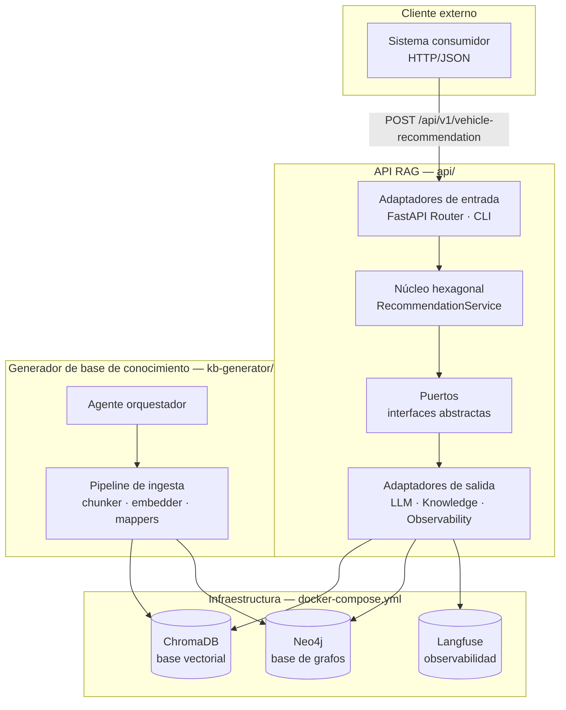
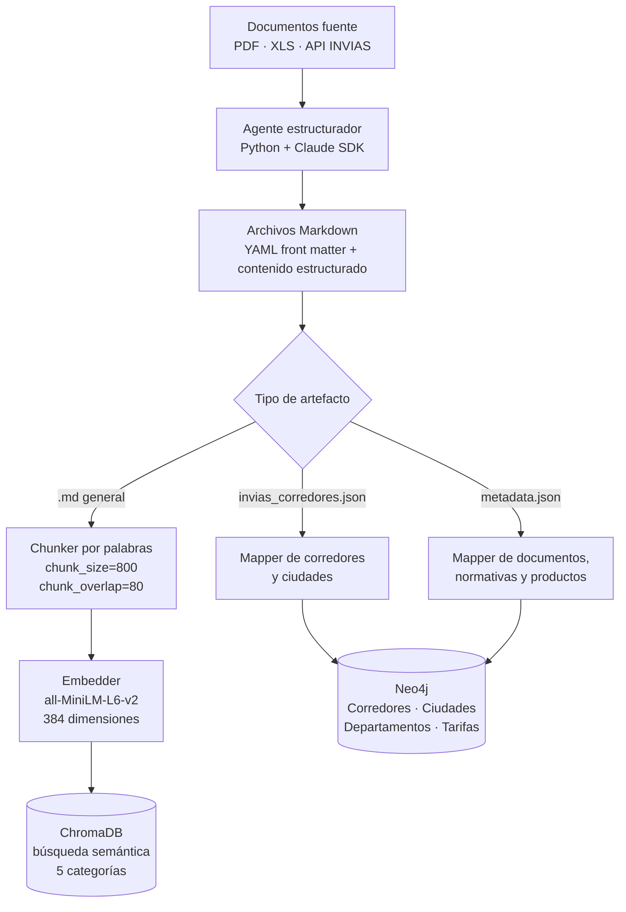
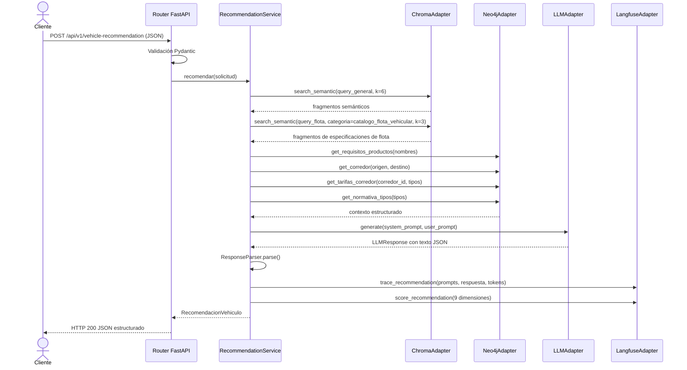
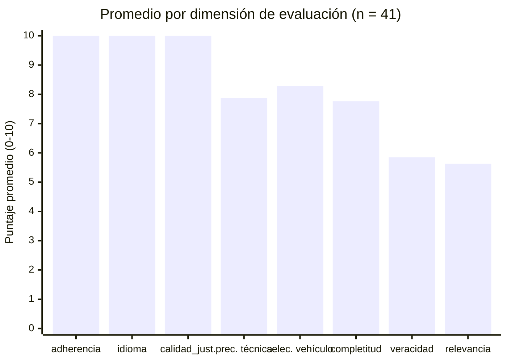

# Diseño y Análisis de Resultados. Entrega Final

**Informe técnico. Caso de aplicación**

**API RAG para selección de vehículo**

*Servicio agnóstico al consumidor, construido en Python*

**Autores:**
Edward Alejandro Rayo Cortés, Elizabeth Toro Chalarca, Santiago Andrés Cardona Julio

Medellín, 2025

---

## Historia de versiones

| Versión | Fecha    | Descripción del cambio                                                                                                                                             |
|---------|----------|--------------------------------------------------------------------------------------------------------------------------------------------------------------------|
| 1       | 20250410 | Inicio. Definición de la funcionalidad RAG y de la base de conocimiento. Propuesta de arquitectura hexagonal y documentación del caso de aplicación.               |
| 2       | 20260422 | Entrega final. Descripción de la arquitectura implementada, pipeline de ingesta, análisis comparativo LLM frente a SLM y evaluación experimental con Langfuse.    |

---

## Contenido

0. Introducción
1. Arquitectura implementada
   - 1.1 Vista general del sistema
   - 1.2 Pipeline de ingesta de la base de conocimiento
   - 1.3 Flujo de inferencia RAG
   - 1.4 Adaptadores de LLM: modelos comerciales frente a modelos locales
   - 1.5 Ingeniería de prompts
   - 1.6 Observabilidad
2. Evolución respecto a la propuesta inicial
3. Evaluación experimental
   - 3.1 Diseño de la evaluación
   - 3.2 Solicitudes de prueba
   - 3.3 Métricas de evaluación
   - 3.4 Resultados generales
   - 3.5 Análisis por solicitud
   - 3.6 Análisis por dimensión
4. Hallazgos y discusión
5. Conclusiones
6. Referencias
7. Apéndice A. Glosario de siglas y abreviaturas

---

## 0. Introducción

La entrega inicial [1] estableció el diseño de una API RAG para la selección inteligente de vehículos de transporte en logística agrícola colombiana. El servicio se concibió con arquitectura hexagonal, una base de conocimiento documental especializada y capacidad de integración con múltiples proveedores de modelos de lenguaje. Esta segunda entrega describe la implementación efectiva del sistema, documenta las decisiones que difirieron de la propuesta original y presenta los resultados de la evaluación experimental realizada sobre 41 trazas registradas en la plataforma de observabilidad Langfuse [2].

El servicio construido respetó el enfoque agnóstico al consumidor definido en [1]: recibió un pedido con datos del producto y la flota disponible, recuperó contexto de una base vectorial (ChromaDB) [3] y una base de grafos (Neo4j) [4], razonó mediante un modelo de lenguaje y retornó una recomendación estructurada. La arquitectura hexagonal, descrita como propuesta en la entrega anterior, se implementó en su totalidad.

Los tres componentes del repositorio, la API REST, el generador de la base de conocimiento y la infraestructura de datos, operaron de forma independiente. Esta separación preservó la cohesión del dominio y permitió actualizar la base documental sin detener el servicio de inferencia, una característica determinante para entornos logísticos donde las normativas, los corredores viales y los catálogos de flota se actualizan periódicamente.

El documento se organizó de la siguiente forma. La Sección 1 describe la arquitectura implementada, con énfasis en el pipeline de ingesta y en las variaciones de comportamiento según el tipo de modelo de lenguaje empleado. La Sección 2 detalla los cambios respecto a la propuesta inicial. La Sección 3 presenta el diseño experimental y los resultados obtenidos. La Sección 4 discute los hallazgos. La Sección 5 recoge las conclusiones.

---

## 1. Arquitectura implementada

### 1.1 Vista general del sistema

El sistema se compone de tres subsistemas independientes. En primer lugar, la API REST (directorio `api/`), que expone el endpoint de recomendación y contiene el núcleo hexagonal. En segundo lugar, el generador de la base de conocimiento (`kb-generator/`), que descarga, estructura e ingesta documentos en ChromaDB y Neo4j. En tercer lugar, la infraestructura de datos (`docker-compose.yml`), que orquesta ChromaDB y Neo4j como servicios accesibles por ambos componentes.

La Figura 1 presenta la vista general del sistema con las relaciones entre sus capas principales.

*Figura 1. Vista general de la arquitectura implementada.*

El núcleo hexagonal concentró la lógica de aplicación y de dominio sin dependencias directas hacia frameworks, bases de datos ni proveedores de LLM. Los cinco puertos definidos, `KnowledgeRepository`, `GraphRepository`, `LLMProvider`, `EmbeddingProvider` y `ObservabilityPort`, operaron como interfaces abstractas que los adaptadores de salida implementaron. Esta separación permitió intercambiar el proveedor de LLM mediante variable de entorno, sin alterar el caso de uso `RecommendationService`.

### 1.2 Pipeline de ingesta de la base de conocimiento

La base de conocimiento se construyó a partir de documentos estructurados en formato Markdown. Cada documento fuente (PDF, XLS, datos de API) se transformó en un archivo `.md` con YAML front matter que registró la categoría, la fuente y la fecha de actualización. Los archivos en formato bruto residieron en `base_conocimiento/fuentes/` y no se ingestaron directamente; la ingestión operó sobre los Markdown en `base_conocimiento/estructurados/`.

La Figura 2 presenta el flujo del pipeline de ingesta de extremo a extremo.

*Figura 2. Pipeline de ingesta de la base de conocimiento.*

El proceso de segmentación aplicó una ventana deslizante sobre palabras con `chunk_size=800` y `chunk_overlap=80`. Este esquema difirió de la propuesta inicial [1], que anticipaba el uso del `RecursiveCharacterTextSplitter` de LangChain [5]. Se optó por una implementación propia para reducir dependencias externas y mantener control directo sobre la granularidad de la segmentación por dominio.

Cada chunk se almacenó en ChromaDB con metadatos de categoría, fuente y posición en el documento original. Las cinco categorías documentales, `fichas_tecnicas_productos`, `catalogo_flota_vehicular`, `condiciones_rutas_vias`, `tarifas_costos_transporte` y `normativa_transporte`, se preservaron como metadatos para habilitar el filtrado por categoría durante la recuperación semántica.

El modelo de embeddings `all-MiniLM-L6-v2` [6], con vectores de 384 dimensiones, se ejecutó de forma local mediante SentenceTransformers. Esta elección respondió a dos criterios: ausencia de costo por token y posibilidad de operación sin acceso a internet, condición relevante para despliegues en entornos con restricciones de conectividad o requisitos de confidencialidad.

La ingestión en Neo4j operó mediante mappers especializados por tipo de entidad. Los corredores viales, con sus ciudades de origen y destino, se modelaron como nodos `(:Corredor)` conectados a `(:Ciudad)` y `(:Departamento)`. Los requisitos de transporte por producto [7], las normativas vigentes [8] y las tarifas por tipo de vehículo y corredor se ingestaron como nodos relacionados. Esta estructura habilitó las cuatro consultas Cypher parametrizadas que el `GraphRepository` ejecutó durante cada inferencia: requisitos del producto, corredor entre ciudades, tarifas del corredor y normativa por tipo de vehículo.

### 1.3 Flujo de inferencia RAG

El flujo de inferencia siguió cuatro fases desde la recepción de la solicitud hasta la entrega de la respuesta al consumidor. La Figura 3 presenta la secuencia de llamadas entre componentes.

*Figura 3. Diagrama de secuencia del flujo de inferencia RAG.*

La recuperación semántica realizó dos consultas a ChromaDB: una genérica sobre el pedido completo y una específica filtrada por la categoría `catalogo_flota_vehicular`. Los fragmentos no duplicados de ambas consultas se concatenaron antes de construir el prompt. Este doble paso de recuperación no estaba contemplado en la propuesta inicial; se incorporó al observar que la consulta genérica tendía a recuperar fragmentos de normativa y condiciones de ruta, dejando sin representación las especificaciones técnicas de los vehículos disponibles en la flota.

### 1.4 Adaptadores de LLM: modelos comerciales frente a modelos locales

El sistema implementó cuatro adaptadores del puerto `LLMProvider`: `AnthropicAdapter` (Claude Sonnet 4.6) [9], `OpenAIAdapter` (GPT-4o-mini) [10], `GoogleAdapter` (Gemini 1.5) y `OllamaAdapter` (modelos locales vía Ollama) [11]. La Tabla 1 contrasta las características operativas de cada grupo.

*Tabla 1. Comparación entre adaptadores de modelos comerciales y modelos locales.*

| Característica | LLMs comerciales (Claude, GPT-4o, Gemini) | SLMs locales (Ollama) |
|---|---|---|
| Modo de salida estructurada | JSON mode nativo o instrucción concisa en prompt | Modo estricto: esquema JSON explícito más ejemplo concreto en prompt |
| Consistencia de salida | Alta. El JSON mode rechaza respuestas con formato incorrecto. | Variable. Requiere instrucciones de formato más detalladas para alcanzar conformidad. |
| Razonamiento con contexto acotado | Mayor adherencia a restricciones del dominio | Dependiente del modelo descargado y del tamaño de contexto disponible |
| Latencia de respuesta | 2-15 segundos (red más inferencia remota) | 5-60 segundos (inferencia local según hardware disponible) |
| Privacidad de los datos | Los prompts viajan a servidores del proveedor externo | Los datos permanecen en el entorno local |
| Costo operativo | Por token consumido en cada inferencia | Hardware local, sin costo por llamada |
| Propiedad en código | `strict_output = False` | `strict_output = True` |

La propiedad `strict_output` del puerto `LLMProvider` determinó cuál de las dos plantillas de prompt aplicó el `PromptBuilder`. Para los modelos comerciales, el prompt del sistema incluyó el esquema JSON en formato de plantilla con instrucciones compactas. Para los modelos locales, el `PromptBuilder` añadió un bloque `<constraints>` con restricciones explícitas y un ejemplo de respuesta completo, lo que redujo la tasa de respuestas con formato incorrecto durante las pruebas con Ollama.

La diferencia más notable en el comportamiento radicó en la adherencia a restricciones del dominio. Los LLMs comerciales respetaron de forma consistente la prohibición de mencionar costos o tiempos de tránsito, incluida en el prompt del sistema. Los modelos locales, con menor capacidad de seguimiento de instrucciones implícitas, requirieron la repetición de esta restricción en el bloque de constraints del modo estricto.

### 1.5 Ingeniería de prompts

El `PromptBuilder` implementó dos plantillas versionadas bajo el identificador `v2`. La plantilla base construyó el prompt en formato XML semi-estructurado, apta para LLMs comerciales. La plantilla estricta extendió la base con un bloque `<constraints>` explícito y un ejemplo de respuesta JSON concreto, activada al detectar `strict_output=True` en el adaptador activo.

El prompt del sistema estableció cuatro elementos. Primero, el rol: ingeniero de logística agrícola colombiana con la responsabilidad de asignar el vehículo óptimo con base en datos técnicos, normativos y de carga. Segundo, las reglas de contexto: prioridad de refrigeración para productos perecederos, respeto de la capacidad máxima del vehículo, selección del vehículo más adecuado con alerta de nivel alto cuando ninguno cumplió todos los requisitos, y prohibición de mencionar costos o tiempos de tránsito. Tercero, el flujo de trabajo en cuatro pasos: análisis del pedido, comparación con el contexto recuperado, selección del vehículo y redacción de la justificación. Cuarto, el formato de salida: JSON plano sin bloques de código markdown ni texto introductorio.

El prompt del usuario estructuró la información en cuatro secciones:

- `<document_context>`: fragmentos recuperados de ChromaDB con categoría, fuente y score de similitud.
- `<graph_context>`: datos del corredor vial, requisitos del producto desde Neo4j, normativa aplicable y tarifas disponibles.
- `<transport_request>`: identificador del pedido, fecha de entrega, prioridad, ruta origen-destino y detalle de los productos con peso total.
- `<available_fleet>`: lista de vehículos con identificador, tipo, capacidad en kilogramos y bandera de refrigeración.

La instrucción de cierre del prompt del usuario precisó los campos obligatorios de la respuesta y solicitó explícitamente una entrada en `alternativas` por cada vehículo de la flota no seleccionado, con el motivo de rechazo correspondiente. Esta instrucción fue determinante para mejorar la completitud de las alternativas respecto a versiones anteriores del prompt.

### 1.6 Observabilidad

El puerto `ObservabilityPort` se implementó mediante `LangfuseAdapter`, que registró cada inferencia como una traza en Langfuse self-hosted versión 2.60 [2]. Cada traza capturó el prompt completo (sistema y usuario), la respuesta del LLM, el vehículo seleccionado, el modelo y el proveedor activos, los tokens consumidos y nueve scores de calidad calculados sobre la respuesta procesada.

Los nueve scores se definieron como la tupla canónica `SCORE_KEYS` en el módulo `interfaces.py`, la única fuente de verdad para los nombres de dimensión en todo el sistema. Ambos productores de scores, el `RecommendationService` y el agente de evaluación `llm_comparison_agent.py`, aplicaron una aserción en tiempo de ejecución para garantizar que el conjunto de claves enviado a Langfuse coincidiera con `SCORE_KEYS`. Este mecanismo detectó la discrepancia histórica entre el nombre `completitud` (trazas anteriores al cambio) y `completitud_alternativas` (nombre canónico vigente), y la resolvió sin pérdida de datos mediante un mapa de aliases `_SCORE_ALIASES` aplicado durante la exportación.

---

## 2. Evolución respecto a la propuesta inicial

La implementación conservó los elementos estructurales definidos en [1]: la arquitectura hexagonal, los puertos `KnowledgeRepository`, `LLMProvider` y `EmbeddingProvider`, el adaptador `ChromaAdapter` y el flujo de cuatro fases de la funcionalidad RAG. No obstante, se introdujeron cambios relevantes en siete aspectos que se detallan en la Tabla 2.

*Tabla 2. Cambios entre la propuesta inicial y la implementación final.*

| Aspecto | Propuesta inicial [1] | Implementación final |
|---|---|---|
| Puerto de grafos | `KnowledgeRepository` cubría grafo y base vectorial | `GraphRepository` como puerto independiente de Neo4j con cuatro operaciones Cypher |
| Puerto de observabilidad | No contemplado | `ObservabilityPort` con `LangfuseAdapter` self-hosted |
| Calculador de costos | `CostCalculator` como módulo separado (ADR-0006) | Excluido del alcance. Restricción explícita en el prompt. |
| Segmentador de texto | `RecursiveCharacterTextSplitter` de LangChain | Implementación propia por palabras (`chunk_size=800`, `overlap=80`) |
| Recuperación semántica | Una consulta genérica | Dos consultas: genérica más consulta filtrada por categoría de flota |
| Plantillas de prompt | Una plantilla única | Dos plantillas: base y estricta, según `strict_output` del adaptador |
| Gestión de scores | No especificada | Tupla canónica `SCORE_KEYS` en `interfaces.py` con validación en tiempo de ejecución |

La separación de `GraphRepository` como puerto independiente respondió a la necesidad de consultas Cypher parametrizadas con contratos diferentes al `search_semantic` genérico de `KnowledgeRepository`. Las cuatro operaciones del grafo representaron un contrato diferenciado que, de haberse agrupado bajo `KnowledgeRepository`, habría mezclado dos naturalezas de acceso al conocimiento con semánticas distintas.

La adición de `ObservabilityPort` no estaba en la propuesta inicial. La necesidad surgió durante el desarrollo al requerirse trazabilidad auditable de cada inferencia para el proceso de evaluación experimental. Langfuse, desplegado como servicio self-hosted, permitió registrar prompts, respuestas y scores sin transmitir datos a servidores externos, coherente con la política de privacidad establecida para el adaptador de Ollama.

El `CostCalculator` contemplado en ADR-0006 no se implementó en esta entrega. La restricción se reflejó en el prompt del sistema mediante una instrucción explícita de prohibición, lo que evitó que el modelo generara valores económicos sin base en los datos de la solicitud.

---

## 3. Evaluación experimental

### 3.1 Diseño de la evaluación

La evaluación midió la calidad de las recomendaciones producidas por el sistema con el adaptador de Ollama activo. Se diseñaron seis solicitudes de prueba, identificadas de EVAL-001 a EVAL-006, cada una con una respuesta esperada definida: el vehículo óptimo, los vehículos aceptables y los criterios de rechazo para los demás vehículos de la flota disponible. Las solicitudes cubrieron escenarios con niveles de dificultad diferenciados: requisito de refrigeración para productos perecederos, restricción estricta de capacidad, ambigüedad entre dos vehículos con características similares y casos con restricciones de ruta.

Las trazas se generaron de forma iterativa con el comando `make eval-run`, que ejecutó las solicitudes y registró los resultados en Langfuse sin activar el análisis cualitativo posterior con LLM. El análisis cualitativo se reservó para la etapa de evaluación con el agente `llm_comparison_agent.py`. El total de trazas con scores completos alcanzó 41, distribuidas en 38 ejecuciones del periodo de evaluación formal más 3 trazas tempranas sin scores registrados, excluidas del análisis cuantitativo.

### 3.2 Solicitudes de prueba

La Tabla 3 presenta la distribución de trazas por solicitud, los vehículos seleccionados por el sistema y el promedio de la evaluación.

*Tabla 3. Distribución de trazas por solicitud de evaluación (n = 41 trazas con scores).*

| Solicitud | Trazas evaluadas | Vehículos seleccionados | Promedio |
|-----------|:----------------:|-------------------------|:--------:|
| EVAL-001  | 13               | VEH-01 (100%)           | 8.84     |
| EVAL-002  | 8                | VEH-03 (62.5%), VEH-04 (37.5%) | 8.02 |
| EVAL-003  | 8                | VEH-06 (62.5%), VEH-05 (37.5%) | 7.42 |
| EVAL-004  | 6                | VEH-07 (83.3%), VEH-08 (16.7%) | 8.19 |
| EVAL-005  | 3                | VEH-10 (66.7%), VEH-09 (33.3%) | 7.91 |
| EVAL-006  | 3                | VEH-12 (100%)           | 8.00     |
| **Total** | **41**           |                         | **8.18** |

Como se observa en la Tabla 3, EVAL-001 registró el desempeño más alto (8.84) con selección del vehículo óptimo en el 100% de las ejecuciones. EVAL-003 registró el desempeño más bajo (7.42) con una distribución de selección desfavorable: el sistema eligió con mayor frecuencia el vehículo subóptimo (VEH-06, 62.5%) en lugar del óptimo (VEH-05, 37.5%), lo que señaló este caso como el de mayor dificultad para el pipeline de recuperación.

### 3.3 Métricas de evaluación

La evaluación operó con nueve dimensiones de scoring calculadas de forma determinista por el `RecommendationService` a partir de la respuesta parseada y los datos de la solicitud. La Tabla 4 describe cada dimensión.

*Tabla 4. Definición de las nueve dimensiones de evaluación.*

| Dimensión | Descripción |
|---|---|
| `adherencia_schema` | La respuesta contiene una justificación no vacía y no genérica |
| `idioma` | La justificación está redactada en español |
| `calidad_justificacion` | Extensión mínima (40 palabras) y presencia de vocabulario técnico del dominio |
| `precision_tecnica` | Densidad de términos técnicos especializados en la justificación |
| `seleccion_vehiculo` | Comparación entre el vehículo seleccionado y los criterios de la solicitud (refrigeración, capacidad) |
| `completitud_alternativas` | Presencia de alternativas y coherencia de los motivos de rechazo con el criterio determinante |
| `veracidad` | Mención del producto transportado, el peso total y la ciudad de destino en la justificación |
| `relevancia` | La justificación aborda explícitamente la restricción determinante del caso |
| `promedio` | Media aritmética de las ocho dimensiones anteriores |

### 3.4 Resultados generales

El promedio global del sistema sobre las 41 trazas evaluadas fue de 8.18 sobre 10. Las dimensiones de adherencia estructural y lingüística alcanzaron el máximo posible en todos los casos. Las dimensiones semánticas, que dependieron de la coherencia entre la justificación producida y las restricciones específicas de cada solicitud, presentaron mayor variabilidad.

La Tabla 5 presenta las estadísticas descriptivas por dimensión.

*Tabla 5. Estadísticas por dimensión de evaluación (n = 41).*

| Dimensión | Promedio | Mínimo | Máximo |
|---|:---:|:---:|:---:|
| Adherencia de esquema | 10.00 | 10.0 | 10.0 |
| Idioma | 10.00 | 10.0 | 10.0 |
| Calidad de justificación | 10.00 | 10.0 | 10.0 |
| Precisión técnica | 7.88 | 7.0 | 10.0 |
| Selección de vehículo | 8.29 | 4.0 | 10.0 |
| Completitud de alternativas | 7.76 | 5.0 | 10.0 |
| Veracidad | 5.85 | 3.0 | 10.0 |
| Relevancia | 5.63 | 0.0 | 10.0 |
| Promedio global | 8.18 | 6.2 | 9.6 |

La Figura 4 presenta la distribución de promedios por dimensión de forma gráfica.

*Figura 4. Promedio por dimensión de evaluación sobre 41 trazas.*

Las tres primeras dimensiones presentaron varianza cero: el sistema generó en todos los casos respuestas en JSON válido, en español y con justificaciones que superaron el umbral mínimo de extensión y vocabulario técnico. Este resultado confirmó que el modo de salida estructurada del adaptador de Ollama, reforzado por el prompt estricto, fue suficiente para garantizar la conformidad formal de la respuesta.

### 3.5 Análisis por solicitud

**EVAL-001.** El sistema seleccionó el vehículo óptimo en la totalidad de las 13 ejecuciones. Los scores de relevancia variaron entre 3.0 y 10.0, con una media de 7.08. La variabilidad reflejó diferencias en la profundidad de la justificación: algunas ejecuciones mencionaron explícitamente el criterio determinante del caso, mientras otras produjeron justificaciones de carácter genérico con menor valor informativo para el coordinador logístico.

**EVAL-002.** El sistema seleccionó el vehículo óptimo (VEH-03) en cinco de ocho ejecuciones (62.5%). En las tres ejecuciones en que se eligió VEH-04, los scores de selección de vehículo cayeron a 4.0 y los de relevancia a 0.0, por tratarse de un vehículo que no cumplió el criterio determinante del caso. La media de 8.02 incluyó estas ejecuciones subóptimas, lo que indica que el análisis por solicitud es más informativo que el promedio agregado para identificar escenarios problemáticos.

**EVAL-003.** Este caso presentó el desempeño más bajo (7.42) y la mayor variabilidad de selección: 62.5% de las ejecuciones eligieron VEH-06 (subóptimo), mientras el óptimo (VEH-05) se seleccionó en el 37.5% restante. La inspección de los fragmentos recuperados indicó que el contexto documental disponible para este caso contenía información insuficiente para discriminar con claridad entre las características determinantes de ambos vehículos. Este caso identificó una debilidad del pipeline de recuperación semántica en presencia de restricciones sutiles entre opciones similares.

**EVAL-004.** El sistema seleccionó VEH-07 en cinco de seis ejecuciones (83.3%), con scores de selección de 8.0 en esas ejecuciones. El score de 8.0, en lugar de 10.0, correspondió a que VEH-07 representó la mejor opción dentro de las restricciones pero con una limitación de capacidad parcial. En la ejecución en que se eligió VEH-08, el score de selección alcanzó 10.0, confirmando que ese vehículo fue igualmente aceptable para el caso.

**EVAL-005.** Con tres ejecuciones, el sistema seleccionó VEH-10 (subóptimo) en dos de ellas y VEH-09 (óptimo) en una. La media de 7.91 reflejó el impacto de las selecciones incorrectas. El reducido volumen de trazas para este caso limitó la robustez estadística del resultado.

**EVAL-006.** El sistema seleccionó VEH-12 en la totalidad de las tres ejecuciones, con un promedio de 8.00. Los scores de relevancia se situaron en 5.0, indicando que las justificaciones produjeron el vehículo correcto pero sin abordar explícitamente el criterio determinante del caso.

### 3.6 Análisis por dimensión

**Dimensiones con puntaje perfecto: adherencia, idioma, calidad de justificación.** El prompt estricto del sistema, con el bloque `<constraints>` y el ejemplo de respuesta JSON, garantizó salida JSON válida en todos los casos. Las justificaciones superaron el mínimo de extensión y presencia de vocabulario técnico en el 100% de las ejecuciones. Este resultado es relevante: demuestra que el prompt engineering para SLMs locales, cuando se diseña con suficiente detalle estructural, alcanza la conformidad formal de forma consistente.

**Precisión técnica (7.88).** La dimensión presentó dos valores discretos: 7.0 (presencia de vocabulario técnico general) o 10.0 (presencia de términos del dominio específico como "cadena de frío", "vehículo refrigerado" o "normativa de transporte de alimentos"). La distribución bimodal indica que el sistema generó respuestas técnicas en todos los casos, con un subconjunto que alcanzó mayor especificidad terminológica según el contexto recuperado.

**Selección de vehículo (8.29).** La variabilidad en esta dimensión correlacionó directamente con la dificultad del caso. Los escenarios con criterio determinante claro (EVAL-001, EVAL-006) registraron 10.0 en todas las ejecuciones. Los escenarios con ambigüedad entre vehículos (EVAL-003, EVAL-005) presentaron selecciones erróneas que redujeron el promedio a valores entre 4.0 y 8.0.

**Completitud de alternativas (7.76).** La distribución fue bimodal: 10.0 cuando el sistema listó todos los vehículos rechazados con justificación coherente al criterio del caso, y 5.0 cuando los motivos de rechazo estuvieron presentes pero sin conexión con la restricción determinante. La ausencia de valores intermedios sugiere que el prompt fue suficientemente claro en solicitar la lista de alternativas, pero no en especificar la profundidad del razonamiento de rechazo requerida.

**Veracidad (5.85).** Esta dimensión midió si la justificación mencionó el producto transportado, el peso total y la ciudad de destino. El promedio de 5.85 reveló que el sistema frecuentemente omitió uno o dos de estos elementos, especialmente el peso específico de la carga. Las justificaciones tendieron a referirse a "la carga" de forma genérica sin cuantificarla con los datos de la solicitud.

**Relevancia (5.63, mínimo 0.0).** La dimensión con mayor variabilidad mostró que el sistema no garantizó la referencia explícita al criterio determinante del caso en la justificación. Cuando la restricción era la necesidad de refrigeración, el prompt no siempre indujo al modelo a mencionar la cadena de frío como argumento central. Esta dimensión identificó la brecha más significativa entre la calidad formal de la respuesta y su valor informativo efectivo para el coordinador logístico.

---

## 4. Hallazgos y discusión

Los resultados de la evaluación señalaron tres hallazgos con implicaciones directas sobre el diseño del sistema.

El primero concierne al prompt engineering para SLMs. El modo estricto del `PromptBuilder` garantizó conformidad estructural plena, pero no fue suficiente para inducir al modelo local a producir justificaciones que abordaran explícitamente el criterio determinante del caso. En pruebas informales con LLMs comerciales, la relevancia de las justificaciones fue notablemente mayor sin necesidad del modo estricto. Esta diferencia motivó la recomendación de agregar, en versiones futuras, una sección `<key_constraint>` en el prompt que destaque el criterio determinante antes del bloque de instrucción de generación.

El segundo hallazgo concierne al pipeline de recuperación. EVAL-003 evidenció que la recuperación semántica genérica no discriminó con suficiente precisión entre vehículos similares en el contexto documental. La incorporación del doble paso de recuperación (consulta genérica más consulta filtrada por categoría de flota) fue un avance respecto a la propuesta inicial; no obstante, no resolvió los casos de ambigüedad entre opciones con características próximas. Una estrategia de recuperación con re-ranking o expansión de consulta mejoraría la precisión en estos escenarios.

El tercer hallazgo concierne a las métricas de evaluación. Las dimensiones de veracidad y relevancia mostraron que un score global alto (8.18) no garantiza que la justificación aporte valor al coordinador logístico. Un sistema que generó JSON válido en español con vocabulario técnico obtuvo un score estructural perfecto, aun cuando la justificación no mencionó el criterio que determinó la selección. Las métricas cuantitativas deben complementarse con evaluación cualitativa por parte de expertos del dominio en iteraciones futuras del sistema.

---

## 5. Conclusiones

El sistema RAG para selección inteligente de vehículos se implementó en su totalidad siguiendo la arquitectura hexagonal propuesta en [1]. Los cinco puertos definidos, con sus respectivos adaptadores, permitieron integrar ChromaDB, Neo4j, cuatro proveedores de LLM y Langfuse sin modificar la lógica de dominio. La evaluación experimental sobre 41 trazas arrojó un promedio global de 8.18 sobre 10.

Las dimensiones de conformidad estructural alcanzaron el máximo en todos los casos, lo que confirmó la viabilidad del enfoque de salida estructurada mediante prompt engineering diferenciado según el tipo de modelo. Las dimensiones semánticas, en particular relevancia (5.63) y veracidad (5.85), identificaron oportunidades de mejora concretas: un bloque de restricción determinante en el prompt y una estrategia de recuperación con re-ranking para casos de ambigüedad documental.

La separación entre el generador de la base de conocimiento y la API de inferencia demostró su valor práctico: la base documental se actualizó múltiples veces durante el desarrollo sin requerir modificaciones en el servicio. Esta característica es determinante para la operación del sistema en un entorno logístico donde las normativas de transporte [7, 8], las condiciones de los corredores viales [12] y los catálogos de flota se actualizan con frecuencia.

La adopción de `SCORE_KEYS` como única fuente de verdad para los nombres de dimensión, con validación en tiempo de ejecución en ambos productores de scores, eliminó la fuente de error más frecuente durante el desarrollo: la divergencia silenciosa entre los nombres de scores enviados a Langfuse desde el servicio y desde el agente de evaluación.

---

## 6. Referencias

[1] E. A. Rayo Cortés, E. Toro Chalarca y S. A. Cardona Julio, "Arquitectura y Desarrollo para Inteligencia Artificial Generativa: API RAG para Selección Inteligente de Vehículo," Informe técnico v1, EAFIT, Medellín, abr. 2025.

[2] Langfuse GmbH, "Langfuse: Open Source LLM Engineering Platform," versión 2.60, 2024. [En línea]. Disponible en: https://langfuse.com.

[3] Chroma Inc., "Chroma: the AI-native open-source embedding database," 2023. [En línea]. Disponible en: https://www.trychroma.com.

[4] Neo4j Inc., *Neo4j Graph Database Manual v5*, 2024. [En línea]. Disponible en: https://neo4j.com/docs.

[5] H. Chase, "LangChain: Building applications with LLMs through composability," GitHub, 2022. [En línea]. Disponible en: https://github.com/langchain-ai/langchain.

[6] N. Reimers e I. Gurevych, "Sentence-BERT: Sentence Embeddings using Siamese BERT-Networks," en *Proc. 2019 Conf. on Empirical Methods in Natural Language Processing (EMNLP)*, Hong Kong, 2019, pp. 3982-3992.

[7] Ministerio de Transporte de Colombia, "Resolución 0002505 de 2004: condiciones técnicas para el transporte de alimentos y bebidas," Bogotá, 2004.

[8] Instituto Nacional de Vigilancia de Medicamentos y Alimentos (INVIMA), "Lineamientos para el transporte de alimentos en cadena de frío," Bogotá, 2022.

[9] Anthropic, "Claude: AI assistant by Anthropic," 2024. [En línea]. Disponible en: https://www.anthropic.com.

[10] OpenAI, "GPT-4o: Technical report," 2024. [En línea]. Disponible en: https://openai.com.

[11] Ollama, "Ollama: Get up and running with large language models locally," 2024. [En línea]. Disponible en: https://ollama.com.

[12] Instituto Nacional de Vías (INVIAS), "Estado de la red vial nacional: corredores y condiciones de tránsito," 2024. [En línea]. Disponible en: https://www.invias.gov.co.

[13] P. Lewis et al., "Retrieval-Augmented Generation for Knowledge-Intensive NLP Tasks," en *Advances in Neural Information Processing Systems*, vol. 33, 2020, pp. 9459-9474.

[14] A. Cockburn, "Hexagonal Architecture," 2005. [En línea]. Disponible en: https://alistair.cockburn.us/hexagonal-architecture.

[15] S. Tiangolo, "FastAPI: Modern, fast web framework for building APIs with Python 3.6+," 2023. [En línea]. Disponible en: https://fastapi.tiangolo.com.

[16] Instituto Colombiano Agropecuario (ICA), "Fichas técnicas de manejo poscosecha y condiciones de transporte de productos agrícolas," 2023. [En línea]. Disponible en: https://www.ica.gov.co.

[17] E. A. Rayo Cortés, E. Toro Chalarca y S. A. Cardona Julio, "ST1701_dis-rag-vehicle-selection: API RAG para selección inteligente de vehículo en logística agrícola colombiana," repositorio GitHub, 2025. [En línea]. Disponible en: https://github.com/elizabethtrch/ST1701_dis-rag-vehicle-selection.

---

## 7. Apéndice A. Glosario de siglas y abreviaturas

| Sigla | Definición |
|---|---|
| API | Application Programming Interface |
| LLM | Large Language Model |
| SLM | Small Language Model |
| RAG | Retrieval-Augmented Generation |
| ADR | Architecture Decision Record |
| ChromaDB | Base de datos vectorial de código abierto |
| Neo4j | Base de datos de grafos orientada a nodos y relaciones |
| CLI | Command-Line Interface |
| JSON | JavaScript Object Notation |
| UUID | Universally Unique Identifier |
| COP | Peso colombiano (moneda) |
| INVIAS | Instituto Nacional de Vías |
| ICA | Instituto Colombiano Agropecuario |
| INVIMA | Instituto Nacional de Vigilancia de Medicamentos y Alimentos |
| OCR | Optical Character Recognition |

